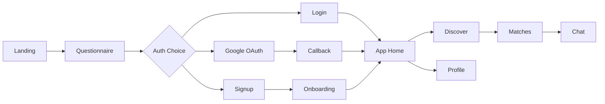
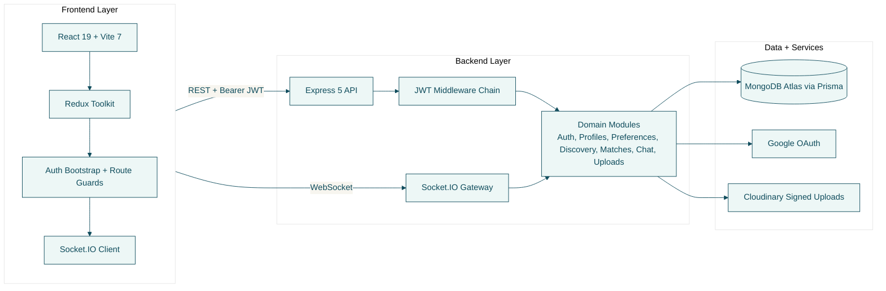

# Flately

<div align="center">
  <a href="https://frontend-roan-one-suwo5dr71s.vercel.app/" target="_blank">
    
  </a>
  <a href="https://www.overleaf.com/read/vmcwbjywptnd#2012eb" target="_blank">
    
  </a>
  <a href="https://drive.google.com/file/d/1UGyUvb7UpbkWTcGGqjuzGQ480eA0b9Iz/view?usp=sharing" target="_blank">
    
  </a>
</div>


[](https://www.typescriptlang.org/)
[](https://nodejs.org/)
[](https://www.mongodb.com/atlas)
[](https://react.dev/)
[](https://socket.io/)

Flately helps users find compatible roommates through guided onboarding, weighted preference matching, and real-time messaging.

---

## The Team

The success of Flately is attributed to a highly coordinated and specialized team:

- **Mitul Bhatia**: Team Lead — Coordinated the entire project lifecycle and managed cross-module integrations.
- **Hardik Maheshwari**: Deployment & User Flow Lead — Spearheaded the deployment architecture and orchestrated the complete user journey.
- **Ajeesh Amreet**: Recommendation & Chat Engineer — Architected the core matching engine and implemented the live Socket.IO-based chat features.
- **Akshat Chauhan**: Database Lead — Designed the Entity-Relationship models and managed the MongoDB Atlas integration.
- **Suryansh Singh**: Strategic Lead, UI & Documentation Manager — Designed the minimalist UI, managed all structural diagrams, authored the core architectural reports, and guided strategic direction.

---

## Product Summary

Flately solves a practical housing pain point: roommate decisions are high-risk and usually made with low-quality context.

Our app improves this by combining:

1. Structured user and lifestyle profiling
2. Preference-weighted match scoring
3. Mutual-interest conversion into direct chat

---

## Hero User Journey



Route mapping:

- Landing: `/`
- Questionnaire: `/start`
- Signup: `/signup`
- Login: `/login`
- Callback: `/auth/callback`
- Onboarding: `/app/onboarding`
- App Home: `/app`
- Discover: `/app/discover`
- Matches: `/app/matches`
- Chat: `/app/chat/:matchId?`
- Profile: `/app/profile`

---

## Architecture Diagram



---

## Tech Stack (Exact Versions)

### Frontend

| Technology | Version |
| --- | --- |
| React | 19.2.3 |
| Vite | 7.2.4 |
| TypeScript | 5.9.3 |
| Redux Toolkit | 2.11.2 |
| React Router DOM | 6.30.3 |
| Socket.IO Client | 4.8.3 |
| TailwindCSS | 4.1.18 |
| Framer Motion | 12.29.2 |
| React Hook Form | 7.71.1 |
| Zod | 4.3.5 |
| Playwright | 1.59.1 |

### Backend

| Technology | Version |
| --- | --- |
| Express | 5.2.1 |
| TypeScript | 5.9.3 |
| Prisma + Prisma Client | 6.19.2 |
| Socket.IO | 4.8.3 |
| jsonwebtoken | 9.0.3 |
| Zod | 3.23.8 |
| Helmet | 8.1.0 |
| express-rate-limit | 8.2.1 |
| tsx | 4.19.2 |
| Vitest | 2.1.8 |

---

## 📊 UML Diagrams

All UML diagrams are verified against the actual TypeScript codebase. Each diagram has a Mermaid source (`.mmd`) and a rendered PNG.

> 📋 **Full Documentation**: [UML_DIAGRAMS.md](docs/UML_DIAGRAMS.md) | 🗺️ **Planning**: [Future Plan](docs/future-plan.md)

### Diagram Overview

| # | Diagram | What It Shows | Source | Image |
|---|---------|---------------|--------|-------|
| 1 | **Class Diagram** | 20 classes, 7 interfaces, Strategy/Factory/Template Method patterns | [.mmd](docs/svg/1_class_diagram.mmd) | [.png](docs/svg/1_class_diagram.png) |
| 2 | **Use Case Diagram** | 5 actors, 15 use cases across 7 system modules | [.mmd](docs/svg/2_usecase_diagram.mmd) | [.png](docs/svg/2_usecase_diagram.png) |
| 3 | **ERD** | 7 Prisma/MongoDB models with all FK/PK constraints | [.mmd](docs/svg/3_erd_diagram.mmd) | [.png](docs/svg/3_erd_diagram.png) |
| 4 | **Activity Diagram** | Full user journey: login → discovery → match → chat | [.mmd](docs/svg/4_activity_diagram.mmd) | [.png](docs/svg/4_activity_diagram.png) |
| 5 | **Sequence Diagram** | Swipe → onboarding check → mutual match creation | [.mmd](docs/svg/5_sequence_diagram.mmd) | [.png](docs/svg/5_sequence_diagram.png) |

---

### 🖼️ Visual Previews

#### 📐 1. Class Diagram — Architecture & Design Patterns

Shows all TypeScript classes, interfaces, abstract classes, and their relationships.

**Key Patterns**: Strategy, Factory, Template Method, Adapter, Singleton, Observer


[📄 View Mermaid Source](docs/svg/1_class_diagram.mmd)

---

#### 🎯 2. Use Case Diagram — Actor-System Interactions

Maps external actors to 15 system operations across 7 modules.

**Actors**: Guest User, Authenticated User, Google OAuth, Cloudinary CDN, Socket.IO Client


[📄 View Mermaid Source](docs/svg/2_usecase_diagram.mmd)

---

#### 🗄️ 3. Entity-Relationship Diagram — Database Schema

All 7 Prisma models with field types, primary keys, foreign keys, and cardinalities.

**Models**: User, Profile, Preference, Swipe, Match, Conversation, Message


[📄 View Mermaid Source](docs/svg/3_erd_diagram.mmd)

---

#### 🔄 4. Activity Diagram — Discovery, Matching & Chat Flow

End-to-end state flow from login through onboarding, discovery, matching, and real-time chat.

**Key Flows**: Authentication gates, onboarding checks, mutual match detection


[📄 View Mermaid Source](docs/svg/4_activity_diagram.mmd)

---

#### 🔀 5. Sequence Diagram — Swipe & Match Process

Complete `POST /discovery/swipe` interaction flow through all backend layers.

**Participants**: Frontend → Controller → Service → Matching → Matches → MongoDB


[📄 View Mermaid Source](docs/svg/5_sequence_diagram.mmd)

---

---

## Product Features Delivered

1. Authentication
   - Email/password signup and login
   - Backend-managed Google OAuth
   - JWT-protected app access

2. Onboarding + Profile Intelligence
   - Structured profile capture
   - Preference capture with weighted dimensions
   - Onboarding gate enforcement before discovery and matching

3. Discovery and Matching
   - Candidate feed retrieval
   - Swipe actions with mutual-like match creation logic

4. Real-time Chat
   - Match-scoped conversations
   - Socket.IO-based message delivery
   - Conversation and message persistence

5. Engineering Quality
   - Manual fetch transport with Adapter + Strategy architecture
   - Typed full-stack contracts and validation layers
   - Architecture and verification docs for reproducible delivery

---

## Local Setup (Demo Ready)

### Prerequisites

- Node.js >= 18
- npm >= 9
- MongoDB Atlas (or local Mongo)
- Google OAuth credentials
- Cloudinary credentials

### Run Backend

```bash
cd backend
npm install
npx prisma generate
npm run dev
```

Backend: [http://localhost:4000](http://localhost:4000)

### Run Frontend

```bash
cd frontend
npm install
npm run dev
```

Frontend: [http://localhost:5174](http://localhost:5174)

### Health Check

```bash
curl http://localhost:4000/health
```

Expected response:

```json
{ "status": "ok" }
```

---

## Verification Snapshot

All verification complete as of 2026-05-03:

- ✅ Backend typecheck: pass
- ✅ Backend tests: pass  
- ✅ Backend build: pass
- ✅ Frontend typecheck: pass
- ✅ Frontend tests: pass
- ✅ Frontend build: pass
- ✅ Manual auth flows: verified

**Testing Guide**: [Manual Auth End-to-End Verification](docs/manual-auth-end-to-end-verification.md)

---

## 📚 Documentation

**[📖 Complete Documentation Index](docs/DOCUMENTATION.md)** - Master navigation for all documentation

### Quick Links

| Category | Documents |
|----------|-----------|
| **Getting Started** | [Setup](docs/project-setup.md) · [User Flow](docs/product-user-flow.md) · [Architecture](docs/architecture.md) |
| **Implementation** | [Backend Reference](docs/backend-code-reference.md) · [Frontend Guide](docs/frontend-guide.md) · [API Reference](docs/api-reference.md) |
| **Database** | [Schema](docs/database-schema.md) · [Matching Algorithm](docs/matching-algorithm.md) |
| **Testing** | [Auth Verification](docs/manual-auth-end-to-end-verification.md) |
| **Design** | [UML Diagrams](docs/UML_DIAGRAMS.md) · [System Design Study Guide](docs/class-first-system-design-study-guide.md) |
| **Planning** | [Future Plan](docs/future-plan.md) · [Historical Archive](docs/historical-archive.md) |

---

## Pitch Using This README Only

1. Open Product Summary to frame the problem.
2. Use Hero User Journey to explain conversion flow.
3. Present Architecture Diagram for technical depth.
4. Show Diagram Library to prove system rigor.
5. Close with Verification Snapshot for execution credibility.

Brand colors used in this README:

- #0F4C5C
- #0A3742
- #EDF7F6
- #F7F5EF
