# Flately

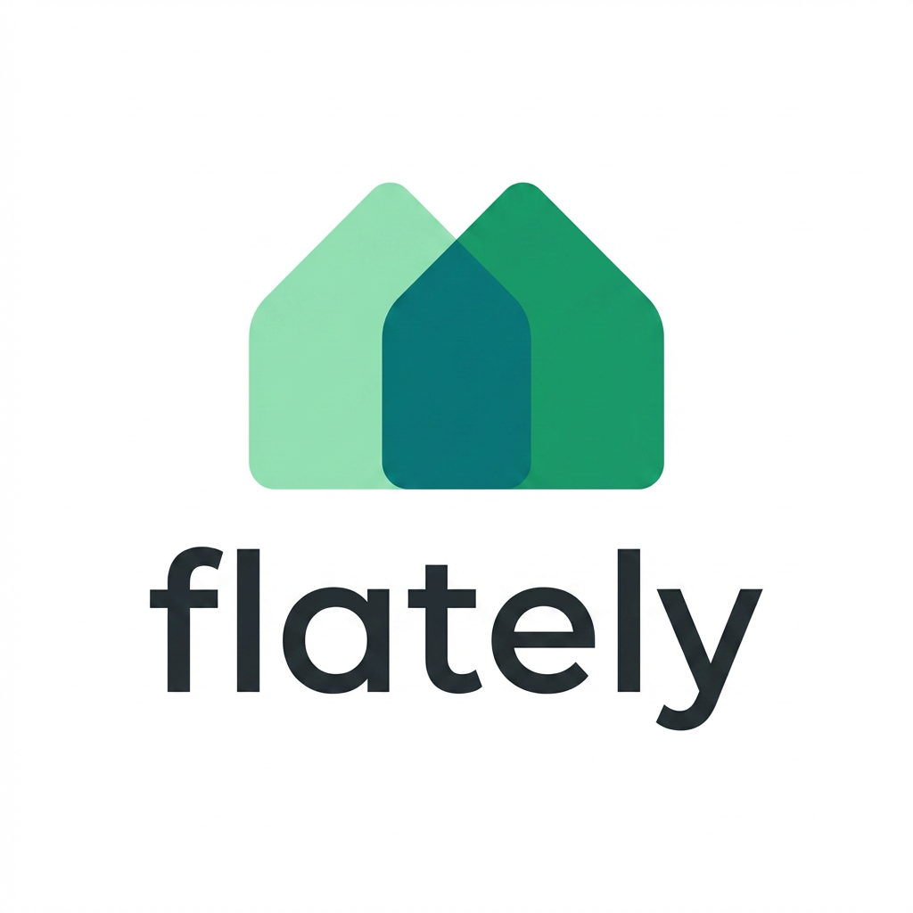


[](https://www.typescriptlang.org/)
[](https://nodejs.org/)
[](https://www.mongodb.com/atlas)
[](https://react.dev/)
[](https://socket.io/)

Flately helps users find compatible roommates through guided onboarding, weighted preference matching, and real-time messaging.

---

## Product Summary

Flately solves a practical housing pain point: roommate decisions are high-risk and usually made with low-quality context.

Our app improves this by combining:

1. Structured user and lifestyle profiling
2. Preference-weighted match scoring
3. Mutual-interest conversion into direct chat

---

## Hero User Journey

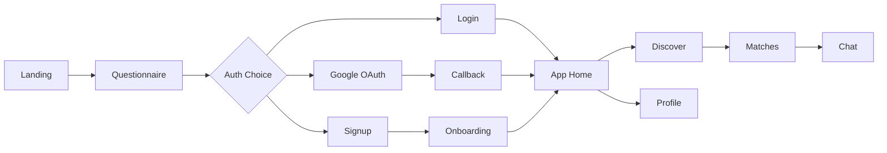

Route mapping:

- Landing: `/`
- Questionnaire: `/start`
- Signup: `/signup`
- Login: `/login`
- Callback: `/auth/callback`
- Onboarding: `/app/onboarding`
- App Home: `/app`
- Discover: `/app/discover`
- Matches: `/app/matches`
- Chat: `/app/chat/:matchId?`
- Profile: `/app/profile`

---

## Architecture Diagram

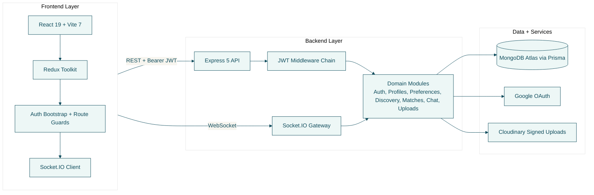

---

## Tech Stack (Exact Versions)

### Frontend

| Technology | Version |
| --- | --- |
| React | 19.2.3 |
| Vite | 7.2.4 |
| TypeScript | 5.9.3 |
| Redux Toolkit | 2.11.2 |
| React Router DOM | 6.30.3 |
| Socket.IO Client | 4.8.3 |
| TailwindCSS | 4.1.18 |
| Framer Motion | 12.29.2 |
| React Hook Form | 7.71.1 |
| Zod | 4.3.5 |
| Playwright | 1.59.1 |

### Backend

| Technology | Version |
| --- | --- |
| Express | 5.2.1 |
| TypeScript | 5.9.3 |
| Prisma + Prisma Client | 6.19.2 |
| Socket.IO | 4.8.3 |
| jsonwebtoken | 9.0.3 |
| Zod | 3.23.8 |
| Helmet | 8.1.0 |
| express-rate-limit | 8.2.1 |
| tsx | 4.19.2 |
| Vitest | 2.1.8 |

---

## Diagram Library

All current UML and ERD diagrams are linked here.

Planning and roadmap:

- [Future Plan (Bugs + System Design)](docs/future-plan.md)

| Diagram | Focus | Canonical Source | Rendered |
| --- | --- | --- | --- |
| 01 Class Diagram | Static architecture & patterns | [Mermaid](docs/diagrams/1_class_diagram.md) | [SVG](docs/svg/01-class-diagram.svg) |
| 02 Use Case Diagram | Actor-system goals | [Mermaid](docs/diagrams/2_use_case_diagram.md) | [SVG](docs/svg/02-use-case.svg) |
| 03 ERD | Data model & relationships | [Mermaid](docs/diagrams/3_erd.md) | [SVG](docs/svg/03-erd.svg) |
| 04a Activity — Onboarding | 6-step registration flow | [Mermaid](docs/diagrams/4_activity_diagrams.md) | [SVG](docs/svg/04a-activity-onboarding.svg) |
| 04b Activity — Discovery | Discovery feed & swipe flow | [Mermaid](docs/diagrams/4_activity_diagrams.md) | [SVG](docs/svg/04b-activity-discovery.svg) |
| 04c Activity — Chat | Real-time chat flow | [Mermaid](docs/diagrams/4_activity_diagrams.md) | [SVG](docs/svg/04c-activity-chat.svg) |
| 05a Sequence — Auth | Google OAuth flow | [Mermaid](docs/diagrams/5_sequence_diagrams.md) | [SVG](docs/svg/05a-seq-auth.svg) |
| 05b Sequence — Discovery | Matching engine interaction | [Mermaid](docs/diagrams/5_sequence_diagrams.md) | [SVG](docs/svg/05b-seq-discovery.svg) |
| 05c Sequence — Swipe | Swipe to mutual match | [Mermaid](docs/diagrams/5_sequence_diagrams.md) | [SVG](docs/svg/05c-seq-swipe.svg) |
| 05d Sequence — Chat | Socket.IO chat flow | [Mermaid](docs/diagrams/5_sequence_diagrams.md) | [SVG](docs/svg/05d-seq-chat.svg) |

### Diagram Previews

Click any section to expand the rendered diagram.

<!-- markdownlint-disable MD033 -->
<details>
<summary>&#x1F4D0; Class Diagram — Architecture & Design Patterns</summary>


</details>

<details>
<summary>&#x1F3AF; Use Case Diagram — Actor Goals</summary>


</details>

<details>
<summary>&#x1F5C4;&#xFE0F; ERD — Entity-Relationship Diagram</summary>


</details>

<details>
<summary>&#x1F504; Activity Diagram 1 — Registration & 6-Step Onboarding</summary>


</details>

<details>
<summary>&#x1F50D; Activity Diagram 2 — Discovery Feed & Swipe Flow</summary>


</details>

<details>
<summary>&#x1F4AC; Activity Diagram 3 — Real-Time Chat Flow</summary>


</details>

<details>
<summary>&#x1F510; Sequence Diagram 1 — Google OAuth Authentication</summary>

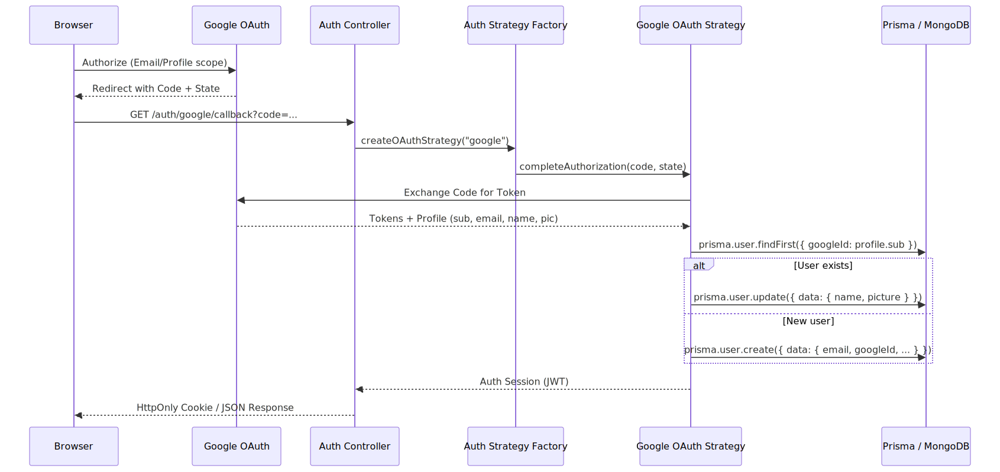

</details>

<details>
<summary>&#x1F9E0; Sequence Diagram 2 — Discovery Feed & Matching Engine</summary>

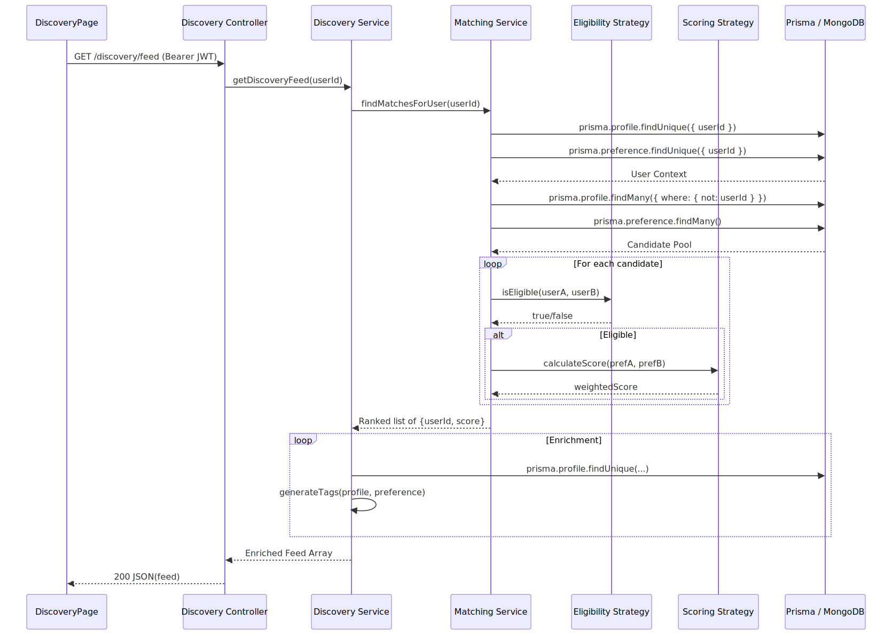

</details>

<details>
<summary>&#x2764;&#xFE0F; Sequence Diagram 3 — Swipe Connect to Mutual Match</summary>

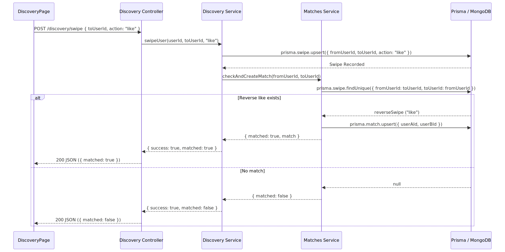

</details>

<details>
<summary>&#x1F4E1; Sequence Diagram 4 — Real-Time Chat via Socket.IO</summary>

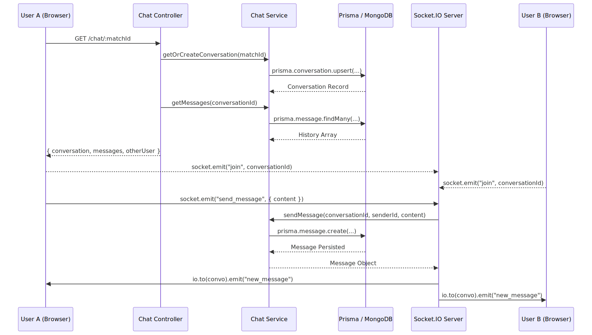

</details>

<!-- markdownlint-enable MD033 -->

---

## Product Features Delivered

1. Authentication
   - Email/password signup and login
   - Backend-managed Google OAuth
   - JWT-protected app access

2. Onboarding + Profile Intelligence
   - Structured profile capture
   - Preference capture with weighted dimensions
   - Onboarding gate enforcement before discovery and matching

3. Discovery and Matching
   - Candidate feed retrieval
   - Swipe actions with mutual-like match creation logic

4. Real-time Chat
   - Match-scoped conversations
   - Socket.IO-based message delivery
   - Conversation and message persistence

5. Engineering Quality
   - Manual fetch transport with Adapter + Strategy architecture
   - Typed full-stack contracts and validation layers
   - Architecture and verification docs for reproducible delivery

---

## Local Setup (Demo Ready)

### Prerequisites

- Node.js >= 18
- npm >= 9
- MongoDB Atlas (or local Mongo)
- Google OAuth credentials
- Cloudinary credentials

### Run Backend

```bash
cd backend
npm install
npx prisma generate
npm run dev
```

Backend: [http://localhost:4000](http://localhost:4000)

### Run Frontend

```bash
cd frontend
npm install
npm run dev
```

Frontend: [http://localhost:5174](http://localhost:5174)

### Health Check

```bash
curl http://localhost:4000/health
```

Expected response:

```json
{ "status": "ok" }
```

---

## Verification Snapshot

- Backend typecheck: pass
- Backend tests: pass
- Backend build: pass
- Frontend typecheck: pass
- Frontend tests: pass
- Frontend build: pass
- Manual auth and route-state verification: complete

Reference: [docs/manual-auth-end-to-end-verification.md](docs/manual-auth-end-to-end-verification.md)

---

## Documentation Index

- Setup: [docs/project-setup.md](docs/project-setup.md)
- Product flow: [docs/product-user-flow.md](docs/product-user-flow.md)
- Architecture: [docs/architecture.md](docs/architecture.md)
- API contract: [docs/api-reference.md](docs/api-reference.md)
- Database schema: [docs/database-schema.md](docs/database-schema.md)
- Frontend reference: [docs/frontend-guide.md](docs/frontend-guide.md)
- Backend reference: [docs/backend-code-reference.md](docs/backend-code-reference.md)
- Historical boundary: [docs/historical-archive.md](docs/historical-archive.md)

---

## Pitch Using This README Only

1. Open Product Summary to frame the problem.
2. Use Hero User Journey to explain conversion flow.
3. Present Architecture Diagram for technical depth.
4. Show Diagram Library to prove system rigor.
5. Close with Verification Snapshot for execution credibility.

Brand colors used in this README:

- #0F4C5C
- #0A3742
- #EDF7F6
- #F7F5EF
