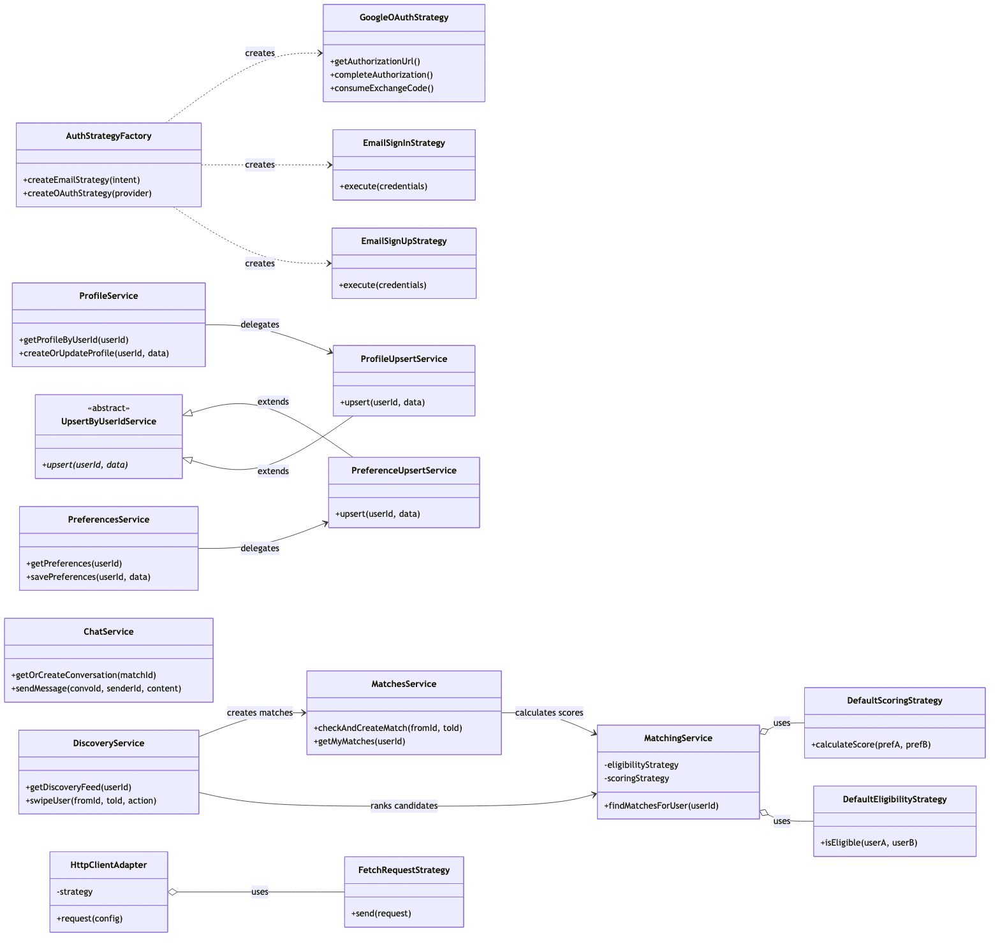
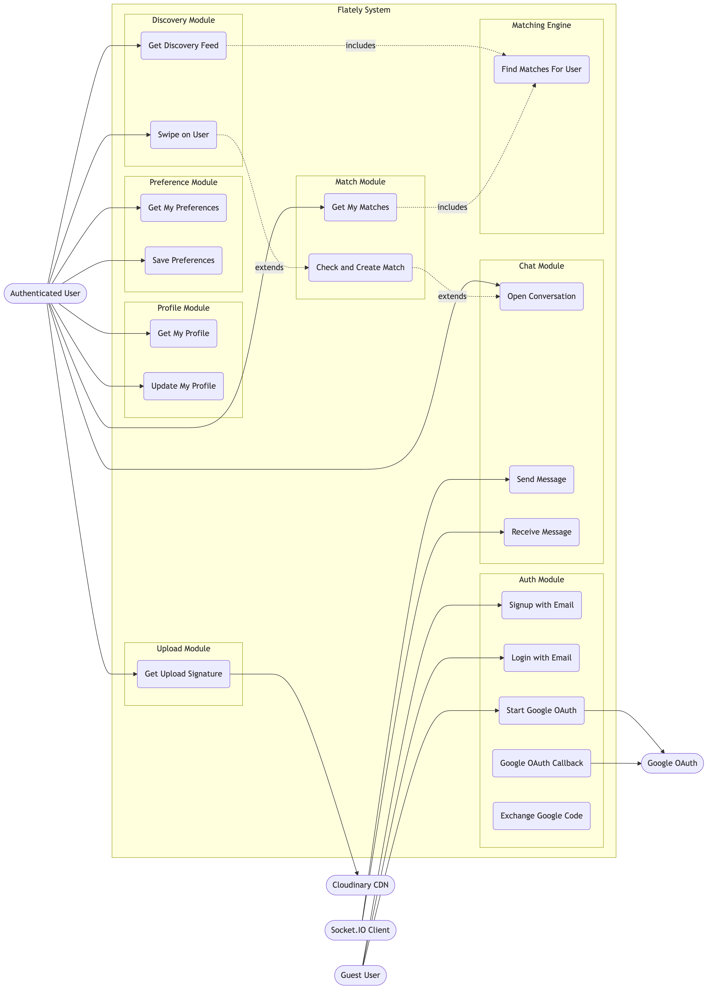
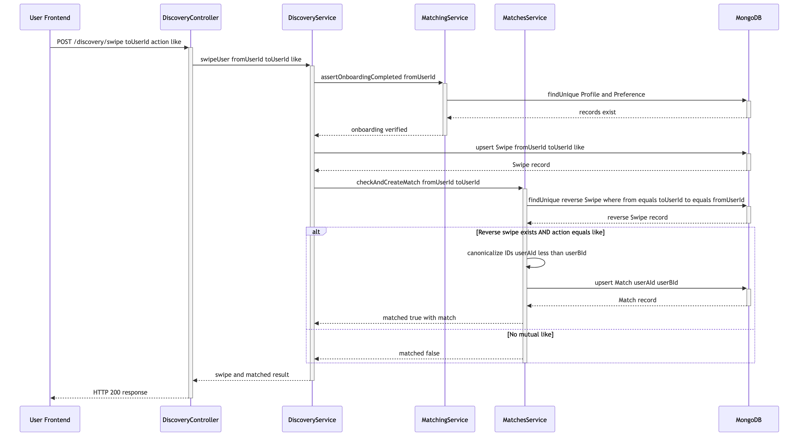

# Flately UML Diagrams

All diagrams are verified against the actual TypeScript codebase.

- **Rendered PNGs**: [`docs/svg/`](svg/) — viewable in any browser, editor, or GitHub
- **Mermaid sources**: `.mmd` files alongside each PNG for editing and regeneration

---

## 1. Class Diagram — Architecture & Design Patterns

> 18 core classes organized by module. Shows Strategy, Factory, Template Method, and Adapter patterns in a clean left-to-right layout.



**Key patterns visible:**

| Pattern | Classes |
|---|---|
| Strategy | `EmailSignUpStrategy`, `EmailSignInStrategy` → `EmailAuthStrategy`; `DefaultEligibilityStrategy` → `EligibilityStrategy`; `DefaultScoringStrategy` → `ScoringStrategy` |
| Factory | `AuthStrategyFactory` → `DefaultEmailAuthStrategyFactory` + `DefaultOAuthAuthorizationStrategyFactory` |
| Template Method | `UpsertByUserIdService` (abstract) → `ProfileUpsertService`, `PreferenceUpsertService` |
| Adapter | `HttpClientAdapter` → `FetchRequestStrategy` → `RequestStrategy` |

---

## 2. Use Case Diagram — Actor-System Interactions

> 5 actors, 15 use cases across 7 system modules with `«include»` and `«extend»` relationships.



**Actors:** Guest User, Authenticated User, Google OAuth, Cloudinary CDN, Socket.IO Client

---

## 3. Entity-Relationship Diagram (ERD)

> 7 Prisma/MongoDB models with all FK/PK constraints and cardinalities from `schema.prisma`.


**Models:** User, Profile, Preference, Swipe, Match, Conversation, Message

---

## 4. Activity Diagram — Discovery, Matching & Chat Flow

> End-to-end state flow: login → onboarding → discovery feed → matching engine → swipe → mutual match → real-time Socket.IO chat.


---

## 5. Sequence Diagram — Swipe & Match Process

> Complete `POST /discovery/swipe` interaction including `assertOnboardingCompleted` guard and mutual-match `alt` block.



**Participants:** User Frontend → DiscoveryController → DiscoveryService → MatchingService → MatchesService → MongoDB

---

## Regenerating Diagrams

To regenerate PNGs from `.mmd` sources:

```bash
npx -y @mermaid-js/mermaid-cli -i docs/svg/<name>.mmd -o docs/svg/<name>.png -b white -s 2
```
