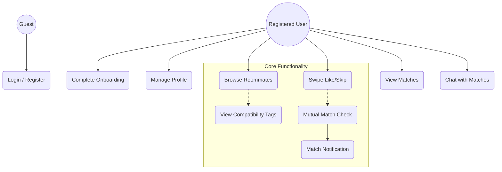
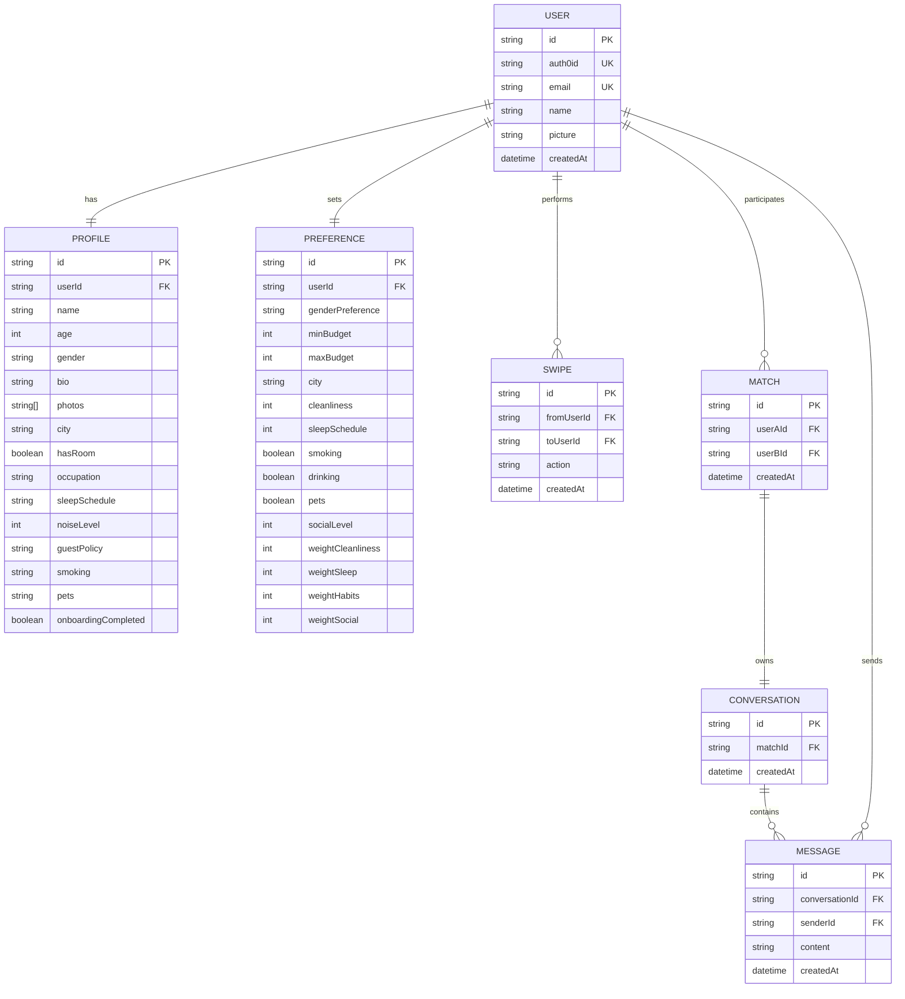
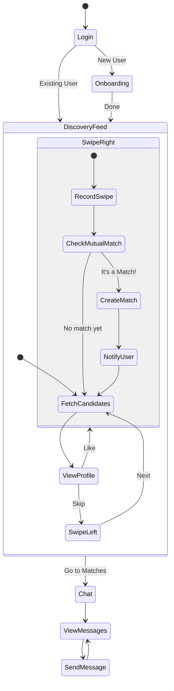
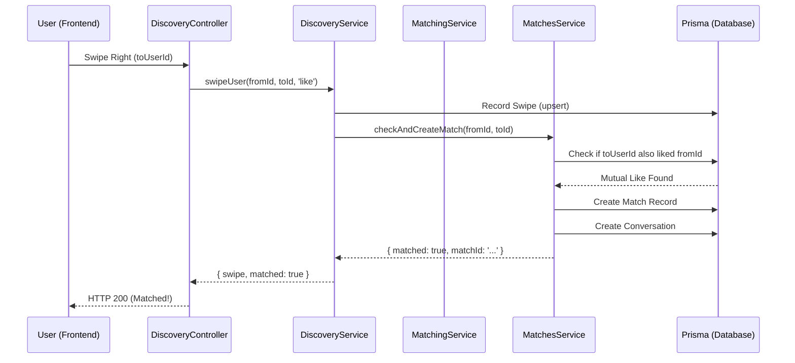

# Flately UML Diagrams

This document contains all the UML diagrams for the Flately project in Mermaid format.

## 1. Class Diagram (Verified)

```mermaid
classDiagram
    class User {
        +String id
        +String auth0id
        +String email
        +String name
        +String picture
        +DateTime createdAt
    }

    class Profile {
        +String id
        +String userId
        +String name
        +Int age
        +String gender
        +String bio
        +Array photos
        +String city
        +Boolean hasRoom
        +String occupation
        +String sleepSchedule
        +Int noiseLevel
        +String guestPolicy
        +String smoking
        +String pets
        +Boolean onboardingCompleted
        +DateTime createdAt
        +DateTime updatedAt
    }

    class Preference {
        +String id
        +String userId
        +String genderPreference
        +Int minBudget
        +Int maxBudget
        +String city
        +Int cleanliness
        +Int sleepSchedule
        +Boolean smoking
        +Boolean drinking
        +Boolean pets
        +Int socialLevel
        +Int weightCleanliness
        +Int weightSleep
        +Int weightHabits
        +Int weightSocial
        +DateTime createdAt
        +DateTime updatedAt
    }

    class Swipe {
        +String id
        +String fromUserId
        +String toUserId
        +String action
        +DateTime createdAt
    }

    class Match {
        +String id
        +String userAId
        +String userBId
        +DateTime createdAt
    }

    class Conversation {
        +String id
        +String matchId
        +DateTime createdAt
    }

    class Message {
        +String id
        +String conversationId
        +String senderId
        +String content
        +DateTime createdAt
    }

    class MatchingService {
        +isEligible(userA, userB) boolean
        +similarityScore(a, b) number
        +booleanScore(a, b) number
        +calculateScore(prefA, prefB) number
        +findMatchesForUser(userId) Array
    }

    class DiscoveryService {
        +getDiscoveryFeed(userId) Array
        +swipeUser(fromId, toId, action) SwipeResult
        -generateTags(profile, pref) Array
    }

    class MatchesService {
        +checkAndCreateMatch(fromId, toId) MatchCheckResult
        +getMyMatches(userId) Array
        -generateMatchTags(profile, pref) Array
    }

    class ChatService {
        +getOrCreateConversation(matchId) Conversation
        +getMessages(conversationId) Message[]
        +sendMessage(convoId, senderId, content) Message
        +validateUserInMatch(matchId, userId) boolean
    }

    class ProfilesService {
        +getProfileByUserId(userId) Profile
        +createOrUpdateProfile(userId, data) Profile
    }

    class PreferencesService {
        +getPreferences(userId) Preference
        +savePreferences(userId, data) Preference
        -validateWeights(weights) boolean
    }

    class UsersService {
        +getOrCreateUser(data) User
    }

    class PrismaClient {
        <<Singleton>>
        +user
        +profile
        +preference
        +swipe
        +match
        +conversation
        +message
    }

    User "1" -- "0..1" Profile : has
    User "1" --> "0..1" Preference : sets
    User "1" --> "*" Swipe : performs
    Match "1" --> "0..1" Conversation : owns
    Conversation "1" -- "*" Message : contains

    UsersService --> PrismaClient : queries
    ProfilesService --> PrismaClient : queries
    PreferencesService --> PrismaClient : queries
    MatchingService --> PrismaClient : queries
    DiscoveryService --> PrismaClient : queries
    MatchesService --> PrismaClient : queries
    ChatService --> PrismaClient : queries

    DiscoveryService --> MatchingService : uses findMatchesForUser
    DiscoveryService --> MatchesService : uses checkAndCreateMatch
```

## 2. Use Case Diagram

## 3. Entity-Relationship Diagram (ERD)

## 4. Activity Diagram (Discovery & Matching)

## 5. Sequence Diagram (Matching Process)

