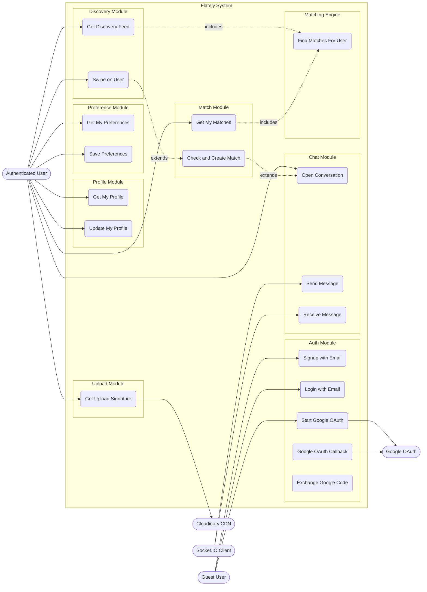
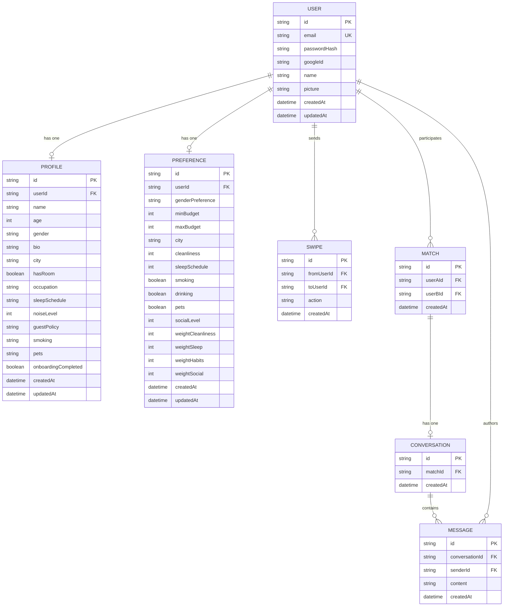
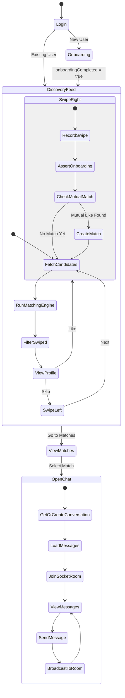
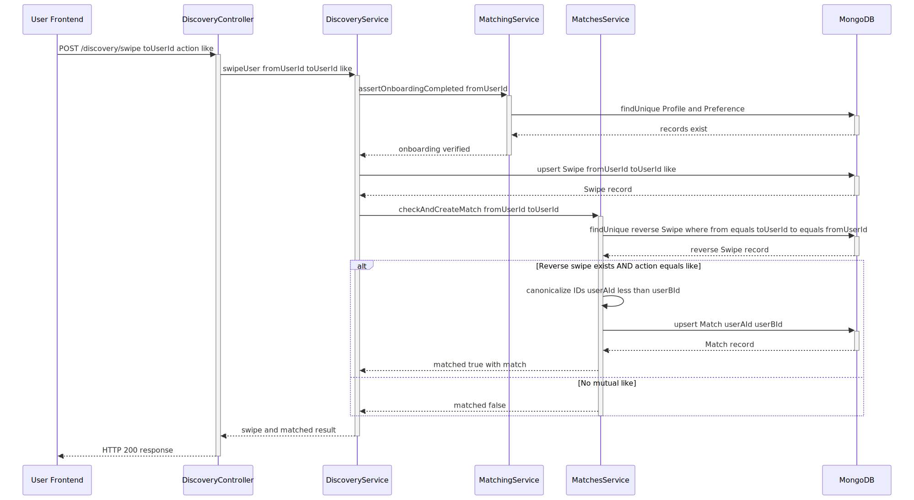
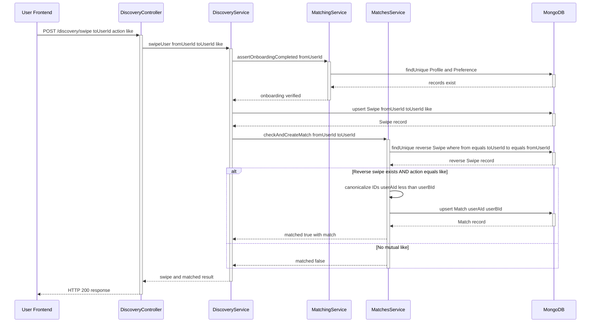

# Flately UML Diagrams

All diagrams have been verified against the actual TypeScript codebase. SVG exports are in [`docs/svg/`](svg/).

---

## 1. Class Diagram

> 20 classes, 7 interfaces, 1 abstract class — showing Strategy, Factory, Template Method, and Adapter patterns.

```mermaid
classDiagram
    direction TB

    class EmailAuthStrategy {
        <<interface>>
        +execute(credentials) Promise~AuthSession~
    }

    class OAuthAuthorizationStrategy {
        <<interface>>
        +getAuthorizationUrl(source, redirectOrigin) string
        +completeAuthorization(code, state) Promise~object~
        +consumeExchangeCode(code) AuthSession
    }

    class EmailAuthStrategyFactory {
        <<interface>>
        +create(intent) EmailAuthStrategy
    }

    class OAuthAuthorizationStrategyFactory {
        <<interface>>
        +create(provider) OAuthAuthorizationStrategy
    }

    class EligibilityStrategy {
        <<interface>>
        +isEligible(userA, userB) boolean
    }

    class ScoringStrategy {
        <<interface>>
        +calculateScore(prefA, prefB) number
    }

    class RequestStrategy {
        <<interface>>
        +send~T~(request) Promise~T~
    }

    class UpsertByUserIdService {
        <<abstract>>
        #findByUserId(userId) Promise~TResult~
        #updateByUserId(userId, data) Promise~TResult~
        #mapCreateData(userId, data) TCreateData
        #createByUserId(data) Promise~TResult~
        +upsert(userId, data) Promise~TResult~
    }

    class EmailSignUpStrategy {
        +execute(credentials) Promise~AuthSession~
    }

    class EmailSignInStrategy {
        +execute(credentials) Promise~AuthSession~
    }

    class GoogleOAuthStrategy {
        -googleOAuthStates: Map
        -googleExchangeCodes: Map
        +getAuthorizationUrl(source, redirectOrigin) string
        +completeAuthorization(code, state) Promise~object~
        +consumeExchangeCode(code) AuthSession
        -cleanExpiredGoogleOAuthState() void
        -cleanExpiredExchangeCodes() void
        -getGoogleConfig() object
        -createGoogleOAuthState(source, origin) string
        -consumeGoogleOAuthState(state) object
        -createExchangeCode(session) string
        -fetchGoogleUserProfile(code) Promise~object~
    }

    class DefaultEmailAuthStrategyFactory {
        -creators: Record
        +create(intent) EmailAuthStrategy
    }

    class DefaultOAuthAuthorizationStrategyFactory {
        -googleOAuthStates: Map
        -googleExchangeCodes: Map
        +create(provider) OAuthAuthorizationStrategy
    }

    class AuthStrategyFactory {
        -emailFactory: EmailAuthStrategyFactory
        -oauthFactory: OAuthAuthorizationStrategyFactory
        +createEmailStrategy(intent) EmailAuthStrategy
        +createOAuthStrategy(provider) OAuthAuthorizationStrategy
    }

    class DefaultEligibilityStrategy {
        +isEligible(userA, userB) boolean
    }

    class DefaultScoringStrategy {
        -similarityScore(a, b, max) number
        -booleanScore(a, b) number
        +calculateScore(prefA, prefB) number
    }

    class MatchingService {
        -eligibilityStrategy: EligibilityStrategy
        -scoringStrategy: ScoringStrategy
        +findMatchesForUser(userId) Promise~Array~
        +assertOnboardingCompleted(userId) Promise~void~
    }

    class DiscoveryService {
        -dependencies: object
        +getDiscoveryFeed(userId) Promise~Array~
        +swipeUser(fromId, toId, action) Promise~object~
        -generateTags(profile, pref) string[]
    }

    class MatchesService {
        -dependencies: object
        +checkAndCreateMatch(fromId, toId) Promise~MatchCheckResult~
        +getMyMatches(userId) Promise~Array~
        -generateMatchTags(profile, pref) string[]
    }

    class ChatService {
        +getOrCreateConversation(matchId) Promise~Conversation~
        +getMessages(conversationId) Promise~Array~
        +sendMessage(convoId, senderId, content) Promise~Message~
        +validateUserInMatch(matchId, userId) Promise~boolean~
    }

    class ProfileUpsertService {
        #findByUserId(userId) Promise~ProfileRecord~
        #updateByUserId(userId, data) Promise~ProfileRecord~
        #mapCreateData(userId, data) ProfileCreateData
        #createByUserId(data) Promise~ProfileRecord~
    }

    class ProfileService {
        +getProfileByUserId(userId) Promise~Profile~
        +createOrUpdateProfile(userId, data) Promise~Profile~
    }

    class PreferenceUpsertService {
        #findByUserId(userId) Promise~PreferenceRecord~
        #updateByUserId(userId, data) Promise~PreferenceRecord~
        #mapCreateData(userId, data) PreferenceCreateData
        #createByUserId(data) Promise~PreferenceRecord~
    }

    class PreferencesService {
        +getPreferences(userId) Promise~Preference~
        +savePreferences(userId, data) Promise~Preference~
    }

    class UploadsService {
        +getCloudinaryUploadSignature() CloudinaryUploadSignature
        -normalizeFolder(folder) string
        -ensureCloudinaryConfig() object
        -createCloudinarySignature(params, secret) string
    }

    class ApiError {
        +status: number
        +data: unknown
        +url: string
    }

    class FetchRequestStrategy {
        +send~T~(request) Promise~T~
    }

    class HttpClientAdapter {
        -strategy: RequestStrategy
        -baseUrl: string
        +request~T~(config) Promise~T~
    }

    EmailAuthStrategy <|.. EmailSignUpStrategy
    EmailAuthStrategy <|.. EmailSignInStrategy
    OAuthAuthorizationStrategy <|.. GoogleOAuthStrategy
    EmailAuthStrategyFactory <|.. DefaultEmailAuthStrategyFactory
    OAuthAuthorizationStrategyFactory <|.. DefaultOAuthAuthorizationStrategyFactory
    EligibilityStrategy <|.. DefaultEligibilityStrategy
    ScoringStrategy <|.. DefaultScoringStrategy
    RequestStrategy <|.. FetchRequestStrategy

    UpsertByUserIdService <|-- ProfileUpsertService
    UpsertByUserIdService <|-- PreferenceUpsertService
    Error <|-- ApiError

    AuthStrategyFactory o-- EmailAuthStrategyFactory
    AuthStrategyFactory o-- OAuthAuthorizationStrategyFactory
    MatchingService o-- EligibilityStrategy
    MatchingService o-- ScoringStrategy
    HttpClientAdapter o-- RequestStrategy

    DefaultEmailAuthStrategyFactory ..> EmailSignUpStrategy : creates
    DefaultEmailAuthStrategyFactory ..> EmailSignInStrategy : creates
    DefaultOAuthAuthorizationStrategyFactory ..> GoogleOAuthStrategy : creates
    ProfileService ..> ProfileUpsertService : delegates
    PreferencesService ..> PreferenceUpsertService : delegates
    DiscoveryService ..> MatchingService : uses
    DiscoveryService ..> MatchesService : uses
    MatchesService ..> MatchingService : uses
```

View Mermaid source

---

## 2. Use Case Diagram

> 5 actors, 15 use cases across 7 system modules.

View Mermaid source

---

## 3. Entity-Relationship Diagram (ERD)

> 7 Prisma models with all FK/PK constraints and cardinalities from `schema.prisma`.

View Mermaid source

---

## 4. Activity Diagram (Discovery & Matching Flow)

> Full user journey from login through discovery, swiping, matching, and real-time chat.

View Mermaid source

---

## 5. Sequence Diagram (Swipe & Match Process)

> Shows the complete POST `/discovery/swipe` flow including onboarding assertion and mutual-match check.

View Mermaid source

---

## Corrections Applied

| Diagram | What was wrong | What was fixed |
|---|---|---|
| **Class** | Had `auth0id` on User, fake `UsersService` class, missing interfaces/abstract/patterns | Rebuilt from actual `class` declarations with all 7 interfaces, Strategy/Factory/Template Method patterns |
| **Use Case** | Only 2 actors, missing Google OAuth, uploads, preferences | 5 actors, 15 use cases, 7 system modules, external services |
| **ERD** | `auth0id` field, missing `passwordHash`/`googleId`/`updatedAt`, invalid `string[]` type | All fields match `schema.prisma`, correct cardinalities |
| **Activity** | Showed Conversation creation on match (wrong) | Conversation is lazily created in chat; added matching engine + socket steps |
| **Sequence** | Missing `assertOnboardingCompleted`, showed Conversation creation in MatchesService | Added onboarding check, removed incorrect Conversation step, added alt block |
