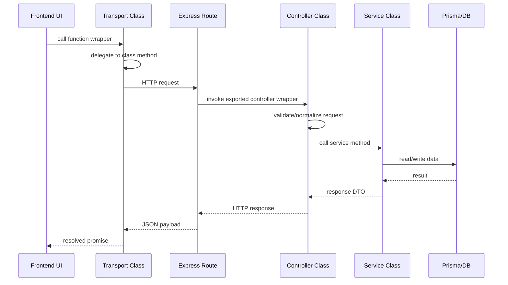

# Flately Class-First System Design Study Guide

## 1. Purpose

This document explains the class-first refactor applied across backend service/controller layers and frontend transport layers.

Goals achieved:

- Introduce real classes so architecture and diagrams reflect actual runtime types.

- Preserve route and call-site compatibility through exported function wrappers.

- Keep behavior stable while improving design-pattern clarity and extensibility.

## 2. Refactor Strategy

### 2.1 Compatibility-First Rule

Every refactored module follows the same migration shape:

1. Create a class (`XService`, `XController`, or `XTransport`) containing core logic.

2. Create a module-level singleton instance.

3. Keep original named exports as thin wrappers delegating to the singleton.

This keeps current imports valid, including route wiring and test expectations.

### 2.2 Why This Is Safe

- Route modules still import the same function names.

- Frontend code still imports the same transport function names.

- Existing tests asserting endpoint/url contracts continue to pass unchanged.

## 3. Design Patterns Applied

## 3.1 Facade (Primary)

Each controller/service/transport class acts as a facade over lower-level operations.

Examples:

- `AuthController` orchestrates request parsing, service calls, and error mapping.

- `DiscoveryService` orchestrates swipes, matching, profile/preference joining, and response shaping.

- `CloudinaryService` orchestrates signed/unsigned upload paths and fallback logic.

## 3.2 Adapter

Frontend transport classes adapt domain calls to HTTP request contracts through `apiRequest`.

Examples:

- `DiscoveryTransport.swipeDiscoveryUser(...)` -> `POST /discovery/swipe`

- `MatchesTransport.connectWithUser(...)` -> `POST /matches/connect/:toUserId`

## 3.3 Strategy

Matching already used strategy classes and now remains explicit:

- `DefaultEligibilityStrategy`

- `DefaultScoringStrategy`

These are composed by `MatchingService`.

## 3.4 Template Method

Shared upsert behavior remains in:

- `UpsertByUserIdService`

Concrete implementations:

- `ProfileUpsertService`

- `PreferenceUpsertService`

## 3.5 Dependency Injection (Lightweight)

Services that coordinate other services accept injectable dependencies with defaults.

Examples:

- `DiscoveryService` receives `checkAndCreateMatch`, `assertOnboardingCompleted`, and `findMatchesForUser`.

- `MatchesService` receives `findMatchesForUser`.

This improves testability while preserving runtime defaults.

## 4. Class-First Layer Model

```mermaid
classDiagram
  class AuthController
  class AuthService

  class DiscoveryController
  class DiscoveryService

  class MatchesController
  class MatchesService

  class MatchingController
  class MatchingService
  class DefaultEligibilityStrategy
  class DefaultScoringStrategy

  class ProfilesController
  class ProfileService
  class ProfileUpsertService
  class UpsertByUserIdService

  class PreferencesController
  class PreferencesService
  class PreferenceUpsertService

  class ChatController
  class ChatService

  class UploadsController
  class UploadsService

  class UsersController
  class UsersService

  class AuthTransport
  class DiscoveryTransport
  class MatchesTransport
  class ProfileTransport
  class PreferencesTransport
  class ChatTransport
  class CloudinaryService

  AuthController --> AuthService
  DiscoveryController --> DiscoveryService
  MatchesController --> MatchesService
  MatchingController --> MatchingService
  ProfilesController --> ProfileService
  PreferencesController --> PreferencesService
  ChatController --> ChatService
  UploadsController --> UploadsService
  UsersController --> UsersService

  MatchingService --> DefaultEligibilityStrategy
  MatchingService --> DefaultScoringStrategy

  ProfileUpsertService --|> UpsertByUserIdService
  PreferenceUpsertService --|> UpsertByUserIdService
  ProfileService --> ProfileUpsertService
  PreferencesService --> PreferenceUpsertService
```



## 5. Wrapper Contract Pattern

## 5.1 Backend Wrapper Example

```ts
const discoveryService = new DiscoveryService()

export async function getDiscoveryFeed(userId: string) {
  return discoveryService.getDiscoveryFeed(userId)
}
```

## 5.2 Frontend Wrapper Example

```ts
const matchesTransport = new MatchesTransport()

export function getMyMatches(): Promise<Match[]> {
  return matchesTransport.getMyMatches()
}
```

These wrappers are intentionally minimal and preserve import compatibility.

## 6. Request Flow (After Refactor)



## 7. Detailed Module Notes

## 7.1 Auth Module

Files:

- `backend/src/modules/auth/auth.controller.ts`

- `backend/src/modules/auth/auth.service.ts`

- `backend/src/modules/auth/auth.routes.ts`

Highlights:

- `AuthController` centralizes auth HTTP concerns.

- `AuthService` owns credential login/signup and Google OAuth state/exchange lifecycle.

- Wrapper exports keep route imports stable.

## 7.2 Discovery Module

Files:

- `backend/src/modules/discovery/discovery.controller.ts`

- `backend/src/modules/discovery/discovery.service.ts`

- `backend/src/modules/discovery/discovery.routes.ts`

Highlights:

- `DiscoveryService` composes swipes + matching + profile/preference enrichment.

- Normalization behavior (`superlike`/`skip`) is preserved.

## 7.3 Matches + Matching Modules

Files:

- `backend/src/modules/matches/matches.controller.ts`

- `backend/src/modules/matches/matches.service.ts`

- `backend/src/modules/matches/matches.routes.ts`

- `backend/src/modules/matching/matching.controller.ts`

- `backend/src/modules/matching/matching.service.ts`

- `backend/src/modules/matching/matching.routes.ts`

Highlights:

- `MatchesService` manages reciprocal-like match creation and enriched match listing.

- `MatchingService` owns strategy-driven ranking and onboarding gate checks.

- `findMatches` compatibility export remains available.

## 7.4 Profiles + Preferences Modules

Files:

- `backend/src/modules/profiles/profiles.controller.ts`

- `backend/src/modules/profiles/profiles.service.ts`

- `backend/src/modules/profiles/profiles.routes.ts`

- `backend/src/modules/preferences/preferences.controller.ts`

- `backend/src/modules/preferences/preferences.service.ts`

- `backend/src/modules/preferences/preferences.routes.ts`

- `backend/src/modules/shared/upsert-by-user-id.service.ts`

Highlights:

- Service facades now wrap Template Method upsert classes.

- Weight validation behavior in preferences is preserved.

## 7.5 Chat Module

Files:

- `backend/src/modules/chat/chat.controller.ts`

- `backend/src/modules/chat/chat.service.ts`

- `backend/src/modules/chat/chat.routes.ts`

- `backend/src/modules/chat/chat.socket.ts`

Highlights:

- `ChatService` encapsulates conversation/message primitives.

- `ChatController` handles membership validation and open-chat payload assembly.

## 7.6 Uploads + Users Modules

Files:

- `backend/src/modules/uploads/uploads.controller.ts`

- `backend/src/modules/uploads/uploads.service.ts`

- `backend/src/modules/uploads/uploads.routes.ts`

- `backend/src/modules/users.controllers.ts`

- `backend/src/modules/users.service.ts`

- `backend/src/modules/users.routes.ts`

Highlights:

- `UploadsService` encapsulates Cloudinary signature generation internals.

- `UsersService` encapsulates user lookup/create/update flow with uniqueness recovery.

## 7.7 Frontend Transport Layer

Files:

- `frontend/src/services/auth.transport.ts`

- `frontend/src/services/discovery.transport.ts`

- `frontend/src/services/matches.transport.ts`

- `frontend/src/services/profile.transport.ts`

- `frontend/src/services/preferences.transport.ts`

- `frontend/src/services/chat.transport.ts`

- `frontend/src/services/cloudinary.ts`

- `frontend/src/services/api.ts`

Highlights:

- Transport classes expose domain-friendly methods and keep old function exports.

- Endpoint contracts remain stable and verified by tests.

- `CloudinaryService` handles signed-first then unsigned fallback upload strategy.

## 8. Full File Inventory (Service/Controller/Transport Scope)

### 8.1 Backend modules

- `backend/src/modules/auth/auth.controller.ts`

- `backend/src/modules/auth/auth.routes.ts`

- `backend/src/modules/auth/auth.service.ts`

- `backend/src/modules/chat/chat.controller.ts`

- `backend/src/modules/chat/chat.routes.ts`

- `backend/src/modules/chat/chat.service.ts`

- `backend/src/modules/chat/chat.socket.ts`

- `backend/src/modules/discovery/discovery.controller.ts`

- `backend/src/modules/discovery/discovery.routes.ts`

- `backend/src/modules/discovery/discovery.service.test.ts`

- `backend/src/modules/discovery/discovery.service.ts`

- `backend/src/modules/matches/matches.controller.ts`

- `backend/src/modules/matches/matches.routes.ts`

- `backend/src/modules/matches/matches.service.test.ts`

- `backend/src/modules/matches/matches.service.ts`

- `backend/src/modules/matching/matching.controller.ts`

- `backend/src/modules/matching/matching.routes.ts`

- `backend/src/modules/matching/matching.service.test.ts`

- `backend/src/modules/matching/matching.service.ts`

- `backend/src/modules/preferences/preferences.controller.ts`

- `backend/src/modules/preferences/preferences.routes.ts`

- `backend/src/modules/preferences/preferences.service.test.ts`

- `backend/src/modules/preferences/preferences.service.ts`

- `backend/src/modules/profiles/profiles.controller.ts`

- `backend/src/modules/profiles/profiles.routes.ts`

- `backend/src/modules/profiles/profiles.service.ts`

- `backend/src/modules/shared/upsert-by-user-id.service.test.ts`

- `backend/src/modules/shared/upsert-by-user-id.service.ts`

- `backend/src/modules/uploads/uploads.controller.ts`

- `backend/src/modules/uploads/uploads.routes.ts`

- `backend/src/modules/uploads/uploads.service.ts`

- `backend/src/modules/users.controllers.ts`

- `backend/src/modules/users.routes.ts`

- `backend/src/modules/users.service.ts`

### 8.2 Frontend services

- `frontend/src/services/api.ts`

- `frontend/src/services/auth.transport.ts`

- `frontend/src/services/chat.transport.ts`

- `frontend/src/services/cloudinary.ts`

- `frontend/src/services/discovery.transport.ts`

- `frontend/src/services/matches.transport.ts`

- `frontend/src/services/preferences.transport.ts`

- `frontend/src/services/profile.transport.ts`

- `frontend/src/services/transports.test.ts`

## 9. Verification Evidence

Executed after refactor:

- Backend typecheck: `npm run typecheck` (pass)

- Backend tests: `npm test` (pass)

- Frontend typecheck: `npm run typecheck` (pass)

- Frontend transport contracts: `npm test -- src/services/transports.test.ts` (pass)

## 10. Study Checklist

Use this checklist when reviewing the refactor:

- Confirm each module has a concrete class + singleton + wrapper exports.

- Confirm routes still import original function names.

- Confirm transport tests still pass with unchanged endpoint calls.

- Confirm strategy/template classes remain explicit and discoverable.

- Confirm no behavior changes in normalization, validation, or error mapping.

## 11. Future Increment Path

If you decide to remove wrappers later, do it in phases:

1. Migrate imports to class instances via explicit composition root wiring.

2. Keep wrappers with deprecation notices for one release.

3. Remove wrappers only after route and call-site migration is complete.
