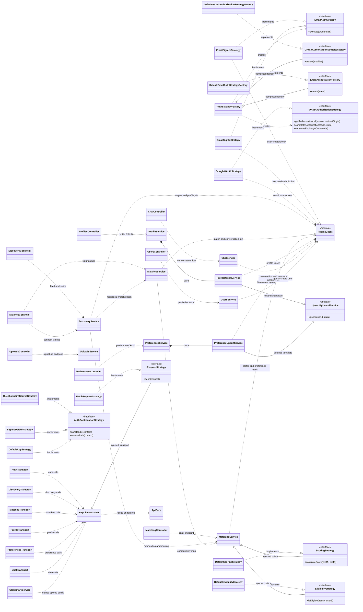

# Flately Canonical System Design + SOLID Dossier

## 1. Document Contract

This is the single source-of-truth study document for the current Flately codebase implementation.

This file is intentionally long and evidence-driven because oral exam questions can target:

1. Which classes were created and why.
2. Which design patterns are actually implemented.
3. Which requested patterns are not implemented.
4. Where SOLID is applied in concrete files.
5. What trade-offs were made.

No claim in this document should be interpreted as architecture intent unless it is visible in source code.

## 2. Step-by-Step Context Gathering Method Used

To avoid hallucination, context was gathered in the following order:

1. Loaded all mandatory pattern workflow instructions and pattern skills.
2. Enumerated backend and frontend module files.
3. Read all relevant service/controller/route/transport/middleware files directly.
4. Verified class declarations, factory/strategy wiring, singleton wrappers where still used, and socket events from source.
5. Cross-checked with tests where behavior contracts are asserted.

## 3. System Composition Roots (How the App Is Wired)

### 3.1 Backend runtime composition

- `backend/src/server.ts`:
  - Creates HTTP server from Express app.
  - Creates Socket.IO server.
  - Registers chat socket handlers via `registerChatSocket(io)`.
- `backend/src/app.ts`:
  - Applies security middleware (`helmet`, `cors`, `rateLimit`, `express.json`).
  - Mounts module routers: `/auth`, `/uploads`, `/matching`, `/profiles`, `/discovery`, `/users`, `/matches`, `/chat`, `/preferences`.

### 3.2 Frontend runtime composition

- `frontend/src/main.tsx`:
  - Wraps app with Redux `Provider`, `AuthProvider`, and `AuthBootstrap`.
  - Mounts RouterProvider.
- `frontend/src/app/router.tsx`:
  - Declares all routes including `/auth/callback` -> `GoogleAuthCallbackPage`.
  - Wraps app routes with `ProtectedRoute` as needed.

### 3.3 Canonical class diagram (source-backed)

Canonical source file: `docs/diagrams/01-class-diagram.mmd`



## 4. Module Contract Implemented

Most refactored backend/frontend areas use this compatibility-safe shape:

1. `export class X... { ... }` contains the logic.
2. A module singleton is instantiated: `const x = new X...()`.
3. Existing named exports remain and delegate to singleton methods.

Auth is the explicit exception after the latest refactor:

1. `auth.controller.ts` now exports direct route-handler functions.
2. `auth.service.ts` now exports direct service functions.
3. Auth object creation is centralized through explicit factory classes (`AuthStrategyFactory`, `DefaultEmailAuthStrategyFactory`, `DefaultOAuthAuthorizationStrategyFactory`).

This preserves route and frontend API compatibility while removing auth service/controller singleton instances.

## 5. Complete Class Inventory (What Exists Today)

## 5.1 Backend classes

### Auth

- Direct handler functions in `backend/src/modules/auth/auth.controller.ts` (no `AuthController` class)
- `EmailAuthStrategy` (interface) in `backend/src/modules/auth/auth.service.ts`
- `EmailSignUpStrategy` in `backend/src/modules/auth/auth.service.ts`
- `EmailSignInStrategy` in `backend/src/modules/auth/auth.service.ts`
- `EmailAuthStrategyFactory` (interface) in `backend/src/modules/auth/auth.service.ts`
- `DefaultEmailAuthStrategyFactory` in `backend/src/modules/auth/auth.service.ts`
- `OAuthAuthorizationStrategy` (interface) in `backend/src/modules/auth/auth.service.ts`
- `OAuthAuthorizationStrategyFactory` (interface) in `backend/src/modules/auth/auth.service.ts`
- `DefaultOAuthAuthorizationStrategyFactory` in `backend/src/modules/auth/auth.service.ts`
- `AuthStrategyFactory` in `backend/src/modules/auth/auth.service.ts`
- `GoogleOAuthStrategy` in `backend/src/modules/auth/auth.service.ts`

### Discovery

- `DiscoveryController` in `backend/src/modules/discovery/discovery.controller.ts`
- `DiscoveryService` in `backend/src/modules/discovery/discovery.service.ts`

### Matches + Matching

- `MatchesController` in `backend/src/modules/matches/matches.controller.ts`
- `MatchesService` in `backend/src/modules/matches/matches.service.ts`
- `MatchingController` in `backend/src/modules/matching/matching.controller.ts`
- `MatchingService` in `backend/src/modules/matching/matching.service.ts`
- `DefaultEligibilityStrategy` in `backend/src/modules/matching/matching.service.ts`
- `DefaultScoringStrategy` in `backend/src/modules/matching/matching.service.ts`

### Profiles + Preferences + Shared Template

- `ProfilesController` in `backend/src/modules/profiles/profiles.controller.ts`
- `ProfileService` in `backend/src/modules/profiles/profiles.service.ts`
- `ProfileUpsertService` in `backend/src/modules/profiles/profiles.service.ts`
- `PreferencesController` in `backend/src/modules/preferences/preferences.controller.ts`
- `PreferencesService` in `backend/src/modules/preferences/preferences.service.ts`
- `PreferenceUpsertService` in `backend/src/modules/preferences/preferences.service.ts`
- `UpsertByUserIdService` (abstract) in `backend/src/modules/shared/upsert-by-user-id.service.ts`

### Chat, Uploads, Users

- `ChatController` in `backend/src/modules/chat/chat.controller.ts`
- `ChatService` in `backend/src/modules/chat/chat.service.ts`
- `UploadsController` in `backend/src/modules/uploads/uploads.controller.ts`
- `UploadsService` in `backend/src/modules/uploads/uploads.service.ts`
- `UsersController` in `backend/src/modules/users.controllers.ts`
- `UsersService` in `backend/src/modules/users.service.ts`

## 5.2 Frontend classes

### Transport + API

- `AuthTransport` in `frontend/src/services/auth.transport.ts`
- `DiscoveryTransport` in `frontend/src/services/discovery.transport.ts`
- `MatchesTransport` in `frontend/src/services/matches.transport.ts`
- `ProfileTransport` in `frontend/src/services/profile.transport.ts`
- `PreferencesTransport` in `frontend/src/services/preferences.transport.ts`
- `ChatTransport` in `frontend/src/services/chat.transport.ts`
- `CloudinaryService` in `frontend/src/services/cloudinary.ts`
- `ApiError` in `frontend/src/services/api.ts`
- `FetchRequestStrategy` in `frontend/src/services/api.ts`
- `HttpClientAdapter` in `frontend/src/services/api.ts`

### Frontend strategy classes

- `QuestionnaireSourceStrategy` in `frontend/src/features/auth/authContinuationResolver.ts`
- `SignupDefaultStrategy` in `frontend/src/features/auth/authContinuationResolver.ts`
- `DefaultAppStrategy` in `frontend/src/features/auth/authContinuationResolver.ts`

## 6. Pattern Analysis (Requested Patterns)

Below is the exact status for the patterns you specifically listed.

## 6.1 Creational: Singleton

Status: Implemented extensively.

Auth module exception:

- Auth no longer uses module singleton service/controller instances after refactor.
- Auth now uses direct exported functions plus factory-driven object creation.

Evidence pattern used:

1. Module-level class instance.
2. Exported wrapper functions delegate to that instance.

Backend examples:

- Auth deliberately avoids this shape in current code.
- Same shape repeated in:
  - `backend/src/modules/discovery/discovery.service.ts`
  - `backend/src/modules/matches/matches.service.ts`
  - `backend/src/modules/matching/matching.service.ts`
  - `backend/src/modules/profiles/profiles.service.ts`
  - `backend/src/modules/preferences/preferences.service.ts`
  - `backend/src/modules/chat/chat.service.ts`
  - `backend/src/modules/uploads/uploads.service.ts`
  - `backend/src/modules/users.service.ts`

Frontend examples:

- `const authTransport = new AuthTransport()` in `frontend/src/services/auth.transport.ts`
- `const matchesTransport = new MatchesTransport()` in `frontend/src/services/matches.transport.ts`
- `const discoveryTransport = new DiscoveryTransport()` in `frontend/src/services/discovery.transport.ts`
- `const chatTransport = new ChatTransport()` in `frontend/src/services/chat.transport.ts`
- `const cloudinaryService = new CloudinaryService()` in `frontend/src/services/cloudinary.ts`
- `export const apiClient = new HttpClientAdapter(...)` in `frontend/src/services/api.ts`
- `getChatSocket()` lazy singleton socket in `frontend/src/features/chat/chat.socket.ts`

Trade-offs:

- Pros: stable imports, low ceremony, migration-safe.
- Cons: implicit global state, harder isolated testing, weaker lifecycle control compared to explicit DI container wiring.

## 6.2 Creational: Factory

Status: Implemented in auth via explicit factory classes and strategy interfaces.

Concrete evidence:

- `AuthStrategyFactory` composes `EmailAuthStrategyFactory` and `OAuthAuthorizationStrategyFactory` in `backend/src/modules/auth/auth.service.ts`.
- `DefaultEmailAuthStrategyFactory` creates `EmailSignUpStrategy` or `EmailSignInStrategy` through `EmailAuthStrategy` in `backend/src/modules/auth/auth.service.ts`.
- `DefaultOAuthAuthorizationStrategyFactory` creates `GoogleOAuthStrategy` through `OAuthAuthorizationStrategy` in `backend/src/modules/auth/auth.service.ts`.

Why this is a practical factory pattern for current scope:

- Product creation/selection is centralized in dedicated factory classes.
- Callers (`signUpWithEmail`, `signInWithEmail`, `getGoogleAuthorizationUrl`, `completeGoogleAuthorization`, `consumeGoogleExchangeCode`) operate against product interfaces, not concrete classes.

Remaining gap:

- This is not yet an `AbstractFactory` for multiple OAuth providers; the current provider family is `google` only.

## 6.3 Structural: Composite

Status: Not explicitly implemented in application domain code.

Reason:

- Current core domain flows (auth, matching, discovery, chat, profile, preferences) are not modeled as tree-composition structures requiring uniform leaf/composite treatment.

Important exam-safe answer:

- React itself uses composite component trees, but this repository does not define its own GoF Composite abstraction for domain objects.

## 6.4 Structural: Adapter

Status: Implemented strongly in frontend networking.

Primary evidence:

1. `RequestStrategy` contract in `frontend/src/services/api.ts`.
2. `FetchRequestStrategy` adapts browser `fetch` into app request behavior.
3. `HttpClientAdapter` adapts strategy + auth/error behavior into `apiRequest` interface.
4. Transport classes adapt domain operations to endpoint contracts.

Examples:

- `AuthTransport.exchangeGoogleAuthCode` -> `/auth/google/exchange`
- `DiscoveryTransport.swipeDiscoveryUser` -> `/discovery/swipe`
- `MatchesTransport.connectWithUser` -> `/matches/connect/:toUserId`
- `ProfileTransport.saveMyProfile` -> `/profiles/me`

Test-backed evidence:

- Endpoint contract assertions in `frontend/src/services/transports.test.ts`.

## 6.5 Behavioural: Observer

Status: Implemented.

Server-side observer/pub-sub:

- `backend/src/modules/chat/chat.socket.ts`
  - Subscribes with `socket.on(...)`.
  - Publishes with `io.to(...).emit(...)`.

Client-side observer semantics:

- `frontend/src/features/chat/chat.socket.ts` socket event reception.
- Redux state subscriptions via selectors in:
  - `frontend/src/features/auth/AuthProvider.tsx`
  - `frontend/src/app/ProtectedRoute.tsx`

Interpretation:

- Chat realtime flow is direct publish-subscribe observer behavior.

## 6.6 Behavioural: Strategy

Status: Implemented in multiple places.

Backend algorithm strategy:

- `EligibilityStrategy` + `DefaultEligibilityStrategy` in `backend/src/modules/matching/matching.service.ts`
- `ScoringStrategy` + `DefaultScoringStrategy` in `backend/src/modules/matching/matching.service.ts`
- Injected into `MatchingService` constructor.

Frontend request strategy:

- `RequestStrategy` + `FetchRequestStrategy` in `frontend/src/services/api.ts`
- Used by `HttpClientAdapter`.

Frontend auth continuation strategy:

- `AuthContinuationStrategy` in `frontend/src/features/auth/authContinuationResolver.ts`
- Concrete strategies:
  - `QuestionnaireSourceStrategy`
  - `SignupDefaultStrategy`
  - `DefaultAppStrategy`

## 6.7 Behavioural: Template Method

Status: Implemented clearly.

Template base class:

- `UpsertByUserIdService` in `backend/src/modules/shared/upsert-by-user-id.service.ts`
  - Defines invariant algorithm in `upsert(...)`.
  - Delegates variable steps to abstract methods.

Concrete implementations:

- `ProfileUpsertService` in `backend/src/modules/profiles/profiles.service.ts`
- `PreferenceUpsertService` in `backend/src/modules/preferences/preferences.service.ts`

Test evidence:

- `backend/src/modules/shared/upsert-by-user-id.service.test.ts`

## 7. Additional Patterns Actually Present (Beyond Requested List)

## 7.1 Proxy (real structural proxy)

Status: Implemented.

Evidence:

- `backend/src/config/prisma.ts` exports `prisma` as `new Proxy({} as PrismaClient, ...)`.
- Proxy lazily instantiates real `PrismaClient` on first property access.

Why this matters:

- This is a concrete, textbook proxy wrapper controlling access and initialization timing.

## 7.2 Facade (service/controller/transport facades)

Status: Implemented as architectural style.

Evidence:

- Controllers expose simplified HTTP entry points while hiding service internals.
- Services aggregate lower-level persistence and policy operations.
- Frontend transports expose domain methods instead of raw fetch calls.

Examples:

- Auth controller handlers (`backend/src/modules/auth/auth.controller.ts`) orchestrate request parsing, error mapping, and auth service delegation.
- `DiscoveryService` orchestrates swipes, matching lookup, and enrichment.
- `CloudinaryService` orchestrates signed/unsigned upload flows.

## 8. SOLID Principle Mapping (Where Applied and Trade-offs)

## 8.1 S: Single Responsibility Principle

Strongly applied:

- Controller/Service split per most modules:
  - `backend/src/modules/*/*.controller.ts`
  - `backend/src/modules/*/*.service.ts`
- Auth exception:
  - `backend/src/modules/auth/auth.controller.ts` is now function-based handlers (no controller class).
  - `backend/src/modules/auth/auth.service.ts` is now function exports + explicit factory classes.
- Transport layer separation from React components:
  - `frontend/src/services/*.transport.ts`

Applied examples:

- `ChatService` focuses on conversation/message persistence in `backend/src/modules/chat/chat.service.ts`.
- `UploadsService` focuses on signature creation in `backend/src/modules/uploads/uploads.service.ts`.

Trade-off areas:

- `GoogleOAuthStrategy` in `backend/src/modules/auth/auth.service.ts` still combines token exchange, profile fetch, and user upsert orchestration.
- `MatchesService.getMyMatches` in `backend/src/modules/matches/matches.service.ts` combines query, enrichment, compatibility join, and tag generation.
- `DiscoveryService` in `backend/src/modules/discovery/discovery.service.ts` handles both feed composition and swipe mutation.

## 8.2 O: Open/Closed Principle

Strongly applied:

- Matching strategies are open for extension without modifying `MatchingService` core flow.
- Template method allows new upsert variants without changing base algorithm.

Trade-off areas:

- Error mapping switch in auth controller (`backend/src/modules/auth/auth.controller.ts`) must be edited for new domain error codes.
- Hardcoded tag generation logic in:
  - `DiscoveryService.generateTags` (`backend/src/modules/discovery/discovery.service.ts`)
  - `MatchesService.generateMatchTags` (`backend/src/modules/matches/matches.service.ts`)

## 8.3 L: Liskov Substitution Principle

Applied:

- `ProfileUpsertService` and `PreferenceUpsertService` substitute safely for `UpsertByUserIdService` contract.
- Matching strategies substitute safely for their strategy contracts.
- Auth strategies/factories substitute safely for auth strategy contracts.
- Frontend auth-continuation strategies substitute for `AuthContinuationStrategy` contract.

Evidence files:

- `backend/src/modules/shared/upsert-by-user-id.service.ts`
- `backend/src/modules/profiles/profiles.service.ts`
- `backend/src/modules/preferences/preferences.service.ts`
- `backend/src/modules/matching/matching.service.ts`
- `backend/src/modules/auth/auth.service.ts`
- `frontend/src/features/auth/authContinuationResolver.ts`

Concrete backend LSP anchors:

- Template base contract in `UpsertByUserIdService` is fulfilled by both concrete subclasses:
  - `ProfileUpsertService extends UpsertByUserIdService` in `backend/src/modules/profiles/profiles.service.ts`
  - `PreferenceUpsertService extends UpsertByUserIdService` in `backend/src/modules/preferences/preferences.service.ts`
- Matching substitution points:
  - `DefaultEligibilityStrategy implements EligibilityStrategy`
  - `DefaultScoringStrategy implements ScoringStrategy`
  - `MatchingService` depends on interface types in constructor.
- Auth substitution points:
  - `EmailSignUpStrategy` and `EmailSignInStrategy` implement `EmailAuthStrategy`
  - `GoogleOAuthStrategy` implements `OAuthAuthorizationStrategy`
  - Factory interfaces are fulfilled by default factory classes.

Clarification boundary:

- `chat.socket.ts` is primarily Observer/pub-sub wiring, not a primary LSP inheritance hotspot.

## 8.4 I: Interface Segregation Principle

Applied:

- Small focused interfaces:
  - `EligibilityStrategy`
  - `ScoringStrategy`
  - `RequestStrategy`
  - `AuthContinuationStrategy`

Evidence files:

- `backend/src/modules/matching/matching.service.ts`
- `frontend/src/services/api.ts`
- `frontend/src/features/auth/authContinuationResolver.ts`

Trade-off:

- `DiscoveryServiceDependencies` bundles three dependencies in one object; still workable, but not maximally granular.

## 8.5 D: Dependency Inversion Principle

Applied:

- Strategy injection into `MatchingService`.
- Request strategy injection into `HttpClientAdapter`.
- Dependency injection bags in `DiscoveryService` and `MatchesService`.

Evidence files:

- `backend/src/modules/matching/matching.service.ts`
- `backend/src/modules/discovery/discovery.service.ts`
- `backend/src/modules/matches/matches.service.ts`
- `frontend/src/services/api.ts`

Trade-off areas:

- Most services still depend directly on concrete Prisma client import (`import prisma from ...`).
- Controllers depend on concrete service wrapper exports.

This is pragmatic DIP, not pure DIP.

## 9. File-by-File Pattern Map

### 9.1 Backend module map

- `backend/src/modules/auth/auth.controller.ts`:
  - Function-based route handlers, request validation, error mapping, OAuth callback redirection orchestration.
- `backend/src/modules/auth/auth.service.ts`:
  - Factory-driven strategy creation using `AuthStrategyFactory`, `DefaultEmailAuthStrategyFactory`, and `DefaultOAuthAuthorizationStrategyFactory`.
- `backend/src/modules/discovery/discovery.controller.ts`:
  - Class facade, input normalization (`superlike`/`skip`).
- `backend/src/modules/discovery/discovery.service.ts`:
  - Class singleton, dependency injection bag, feed enrichment, tag generation.
- `backend/src/modules/matches/matches.controller.ts`:
  - Class facade with connect operation using discovery swipe.
- `backend/src/modules/matches/matches.service.ts`:
  - Class singleton, match creation + enrichment.
- `backend/src/modules/matching/matching.service.ts`:
  - Strategy interfaces + implementations + service injection.
- `backend/src/modules/profiles/profiles.service.ts`:
  - Template method concrete subclass + service facade.
- `backend/src/modules/preferences/preferences.service.ts`:
  - Template method concrete subclass + validation.
- `backend/src/modules/shared/upsert-by-user-id.service.ts`:
  - Template method base abstraction.
- `backend/src/modules/chat/chat.socket.ts`:
  - Observer/pub-sub event wiring.
- `backend/src/config/prisma.ts`:
  - Lazy singleton + Proxy pattern.

### 9.2 Frontend module map

- `frontend/src/services/api.ts`:
  - Adapter + strategy + client facade.
- `frontend/src/services/*.transport.ts`:
  - Class-based adapters from domain calls to REST endpoints.
- `frontend/src/services/cloudinary.ts`:
  - Class singleton with signed/unsigned fallback orchestration.
- `frontend/src/features/auth/authContinuationResolver.ts`:
  - Strategy chain for post-auth routing.
- `frontend/src/features/chat/chat.socket.ts`:
  - Singleton socket accessor.
- `frontend/src/features/auth/AuthProvider.tsx`:
  - Observer-style state reaction with effects and store dispatch.

## 10. Compatibility Wrapper Evidence

Representative backend shape:

```ts
const service = new SomeService()

export async function legacyFunction(args) {
  return service.legacyFunction(args)
}
```

Representative frontend shape:

```ts
const transport = new SomeTransport()

export function legacyApiCall(args) {
  return transport.legacyApiCall(args)
}
```

Routes still call wrapper exports, not direct class instances:

- `backend/src/modules/auth/auth.routes.ts`
- `backend/src/modules/discovery/discovery.routes.ts`
- `backend/src/modules/matches/matches.routes.ts`
- `backend/src/modules/matching/matching.routes.ts`
- `backend/src/modules/profiles/profiles.routes.ts`
- `backend/src/modules/preferences/preferences.routes.ts`
- `backend/src/modules/uploads/uploads.routes.ts`
- `backend/src/modules/chat/chat.routes.ts`
- `backend/src/modules/users.routes.ts`

Auth note:

- Auth now uses direct function exports from `auth.controller.ts` and `auth.service.ts` instead of class-singleton wrappers.

## 11. Test Evidence Anchoring Implemented Behavior

Pattern-behavior-backed tests include:

- Template behavior:
  - `backend/src/modules/shared/upsert-by-user-id.service.test.ts`
- Strategy and matching behavior:
  - `backend/src/modules/matching/matching.service.test.ts`
- Discovery orchestration behavior:
  - `backend/src/modules/discovery/discovery.service.test.ts`
- Match enrichment behavior:
  - `backend/src/modules/matches/matches.service.test.ts`
- Preference validation behavior:
  - `backend/src/modules/preferences/preferences.service.test.ts`
- Frontend adapter endpoint contracts:
  - `frontend/src/services/transports.test.ts`

Current testing gap note:

- There is currently no dedicated `backend/src/modules/auth/auth.service.test.ts`; auth confidence is mostly route/integration-behavior based.

## 12. Teacher Viva Quick Answers (Direct)

### Q1: Which system design classes did you create/apply?

Answer:

- Controller classes for most modules; auth is now function-handler based.
- Service classes per module.
- Transport classes per frontend domain.
- Strategy classes in matching, auth, and auth continuation.
- Factory classes in auth (`AuthStrategyFactory`, `DefaultEmailAuthStrategyFactory`, `DefaultOAuthAuthorizationStrategyFactory`).
- Template base + concrete upsert subclasses.

### Q2: Where is Singleton applied?

Answer:

- Module singletons in many service/controller/transport files.
- Auth module is intentionally non-singleton after refactor.
- Lazy singleton chat socket in frontend.
- Lazy singleton Prisma client in backend config.

### Q3: Where is Factory applied?

Answer:

- Auth uses explicit factory classes in `backend/src/modules/auth/auth.service.ts`.
- `DefaultEmailAuthStrategyFactory` creates `EmailSignUpStrategy` or `EmailSignInStrategy` via `EmailAuthStrategy`.
- `DefaultOAuthAuthorizationStrategyFactory` creates `GoogleOAuthStrategy` via `OAuthAuthorizationStrategy`.
- `AuthStrategyFactory` composes both factory interfaces and is used by exported auth service functions.
- Simple factory function style also exists in `getPrismaClient` and `withAuthenticatedController`.

### Q4: Where is Composite applied?

Answer:

- No explicit custom Composite in domain code.

### Q5: Where is Adapter applied?

Answer:

- `frontend/src/services/api.ts` and all `*.transport.ts` files.

### Q6: Where is Observer applied?

Answer:

- Socket pub-sub in `backend/src/modules/chat/chat.socket.ts`.
- Client socket + Redux subscription behavior in frontend auth/chat flows.

### Q7: Where is Strategy applied?

Answer:

- Matching eligibility/scoring strategies.
- Auth email and OAuth strategies selected through auth factories.
- API request strategy.
- Auth continuation strategies.

### Q8: Where is Template applied?

Answer:

- `UpsertByUserIdService` base + profile/preferences subclasses.

### Q9: Where is SOLID applied most clearly?

Answer:

- S: module controller/service split.
- O/L: strategy and template extension points.
- I: focused interfaces in matching/api/auth continuation.
- D: constructor-injected strategy/dependency bags.

### Q10: What are current architecture trade-offs?

Answer:

- Strong compatibility and low migration risk.
- Weaker pure DIP due direct Prisma imports and singleton globals.
- Some multi-responsibility service methods remain for pragmatic delivery speed.

## 13. Honest Gap Register

1. No multi-provider Abstract Factory yet (current OAuth family is Google only).
2. No custom Composite domain abstraction yet.
3. DIP is partial, not strict, because persistence is concrete-coupled to Prisma.
4. Some services remain large and can be decomposed further.

## 14. Suggested Next Refactor Steps (If Needed Later)

1. Extract auth provider factory if adding more OAuth providers.
2. Split large service methods (especially discovery/matches/auth) into collaborators.
3. Introduce repository interfaces for stronger DIP.
4. Convert tag generation to explicit strategy objects for better OCP compliance.

## 15. Final Summary

Implemented with strong evidence:

- Singleton
- Factory Method (auth)
- Adapter
- Observer
- Strategy
- Template Method
- Proxy (additional)
- Facade-style layering (additional)

Not explicitly implemented in domain code:

- Composite

This is the current, source-verified status of the Flately architecture.

## 16. Recent Clarification Addendum (2026-04-14)

### 16.1 Auth pattern correctness verdict

Result:

- Auth refactor is correct for current goals.
- Strategy + Factory are applied with compatibility-safe exported functions.
- Route/controller external contracts remain unchanged.

What this means practically:

- Signup/signin/OAuth flows are separated by strategy role.
- Construction/selection is centralized in explicit factory classes.
- Call sites depend on interfaces and exported function contracts rather than concrete auth classes.

### 16.2 Auth trade-offs (current state)

1. In-memory OAuth state/exchange stores:
  - Works well on a single process.
  - Not ideal for multi-instance deployments because state is not shared across instances.
2. Factory creation on each exported auth call:
  - Simple and explicit.
  - Introduces minor object churn.
3. Test coverage gap:
  - No dedicated auth service test file yet.

### 16.3 Controller-chain middleware role split

File:
- `backend/src/middlewares/controller-chain.middleware.ts`

Role definitions:

1. Auth guard role:
  - `requireAuthenticatedUser(...)` checks `req.userId` and returns `401` when missing.
2. Domain error mapper role:
  - `domainErrorToHttp(...)` maps domain codes (for example `ONBOARDING_REQUIRED`) to configured HTTP responses.
3. Chain composition role:
  - `withAuthenticatedController(...)` composes guard -> controller -> error mapper.

### 16.4 Type inventory update

Backend type cleanup applied:

- Removed unused `backend/src/types/api.ts`.
- Removed unused `backend/src/types/database.ts`.
- Active backend shared type files are now `backend/src/types/auth.ts` and `backend/src/types/socket.ts`.

### 16.5 In-progress auth and class diagram review

Reviewed artifacts:

- `backend/src/modules/auth/auth.controller.ts`
- `backend/src/modules/auth/auth.routes.ts`
- `backend/src/modules/auth/auth.service.ts`
- `docs/diagrams/01-class-diagram.mmd`

Review result:

- No blocking implementation mismatch was found between auth source and the updated class diagram.
- Backend typecheck passed with the in-progress auth changes.

Auth review notes:

1. Controller refactor to direct function exports preserves endpoint behavior while removing controller singleton wrapping.
2. Service refactor correctly models Strategy + Factory via `DefaultEmailAuthStrategyFactory`, `DefaultOAuthAuthorizationStrategyFactory`, and `AuthStrategyFactory`.
3. Shared in-memory OAuth state/exchange Maps remain a known scaling trade-off for multi-instance deployments.

Diagram review notes:

1. Diagram now reflects the actual auth model (factory-based strategy creation) and removes obsolete auth class nodes.
2. Strategy-to-Prisma dependency edges were updated to concrete auth strategy classes, matching current persistence ownership.
3. Diagram structure remains quality-compliant for class diagrams (explicit direction, labeled relation intent, no placeholder nodes).
