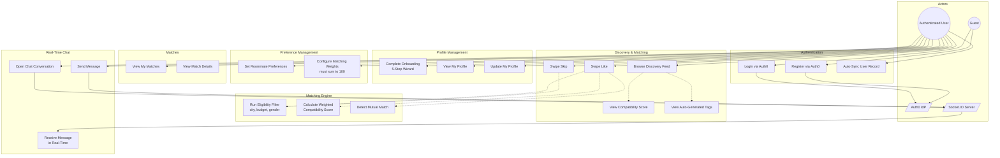

# Use Case Diagram — Flately

```mermaid
graph TB
    subgraph Actors
        Guest((Guest))
        AuthUser((Authenticated User))
        Auth0[/"Auth0 IdP"/]
        SocketIO[/"Socket.IO Server"/]
    end

    subgraph "Authentication"
        UC1["Login via Auth0"]
        UC2["Register via Auth0"]
        UC3["Auto-Sync User Record"]
    end

    subgraph "Profile Management"
        UC4["Complete Onboarding<br/>5-Step Wizard"]
        UC5["View My Profile"]
        UC6["Update My Profile"]
    end

    subgraph "Preference Management"
        UC7["Set Roommate Preferences"]
        UC8["Configure Matching Weights<br/>must sum to 100"]
    end

    subgraph "Discovery & Matching"
        UC9["Browse Discovery Feed"]
        UC10["Swipe Like"]
        UC11["Swipe Skip"]
        UC12["View Compatibility Score"]
        UC13["View Auto-Generated Tags"]
    end

    subgraph "Matching Engine"
        UC14["Run Eligibility Filter<br/>city, budget, gender"]
        UC15["Calculate Weighted<br/>Compatibility Score"]
        UC16["Detect Mutual Match"]
    end

    subgraph "Matches"
        UC17["View My Matches"]
        UC18["View Match Details"]
    end

    subgraph "Real-Time Chat"
        UC19["Open Chat Conversation"]
        UC20["Send Message"]
        UC21["Receive Message<br/>in Real-Time"]
    end

    Guest --> UC1
    Guest --> UC2
    UC1 --> Auth0
    UC2 --> Auth0

    AuthUser --> UC3
    AuthUser --> UC4
    AuthUser --> UC5
    AuthUser --> UC6
    AuthUser --> UC7
    AuthUser --> UC8
    AuthUser --> UC9
    AuthUser --> UC10
    AuthUser --> UC11
    AuthUser --> UC17
    AuthUser --> UC19
    AuthUser --> UC20

    UC9 -.-> UC12
    UC9 -.-> UC13
    UC10 -.-> UC14
    UC10 -.-> UC15
    UC10 -.-> UC16
    UC11 -.-> UC14

    UC19 --> SocketIO
    UC20 --> SocketIO
    SocketIO --> UC21
```
