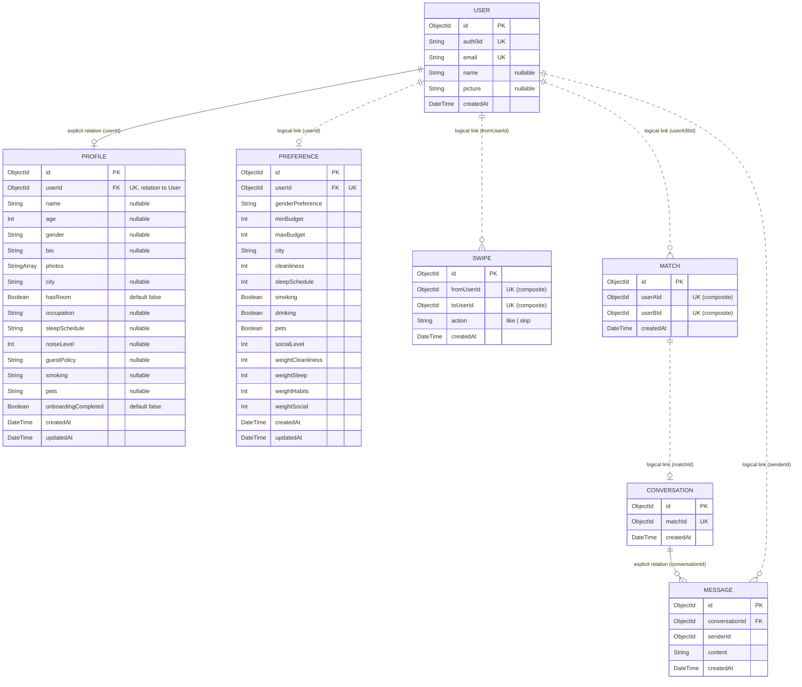

# Entity-Relationship Diagram — Flately

```mermaid
erDiagram
    USER {
        ObjectId id PK
        String auth0id UK
        String email UK
        String name "nullable"
        String picture "nullable"
        DateTime createdAt
    }

    PROFILE {
        ObjectId id PK
        ObjectId userId FK "UK, relation to User"
        String name "nullable"
        Int age "nullable"
        String gender "nullable"
        String bio "nullable"
        StringArray photos
        String city "nullable"
        Boolean hasRoom "default false"
        String occupation "nullable"
        String sleepSchedule "nullable"
        Int noiseLevel "nullable"
        String guestPolicy "nullable"
        String smoking "nullable"
        String pets "nullable"
        Boolean onboardingCompleted "default false"
        DateTime createdAt
        DateTime updatedAt
    }

    PREFERENCE {
        ObjectId id PK
        ObjectId userId FK "UK"
        String genderPreference
        Int minBudget
        Int maxBudget
        String city
        Int cleanliness
        Int sleepSchedule
        Boolean smoking
        Boolean drinking
        Boolean pets
        Int socialLevel
        Int weightCleanliness
        Int weightSleep
        Int weightHabits
        Int weightSocial
        DateTime createdAt
        DateTime updatedAt
    }

    SWIPE {
        ObjectId id PK
        ObjectId fromUserId "UK (composite)"
        ObjectId toUserId "UK (composite)"
        String action "like | skip"
        DateTime createdAt
    }

    MATCH {
        ObjectId id PK
        ObjectId userAId "UK (composite)"
        ObjectId userBId "UK (composite)"
        DateTime createdAt
    }

    CONVERSATION {
        ObjectId id PK
        ObjectId matchId UK
        DateTime createdAt
    }

    MESSAGE {
        ObjectId id PK
        ObjectId conversationId FK
        ObjectId senderId
        String content
        DateTime createdAt
    }

    USER ||--o| PROFILE : "explicit relation (userId)"
    USER ||..o| PREFERENCE : "logical link (userId)"
    USER ||..o{ SWIPE : "logical link (fromUserId)"
    USER ||..o{ MATCH : "logical link (userA/BId)"
    MATCH ||..o| CONVERSATION : "logical link (matchId)"
    CONVERSATION ||--o{ MESSAGE : "explicit relation (conversationId)"
    USER ||..o{ MESSAGE : "logical link (senderId)"
```
