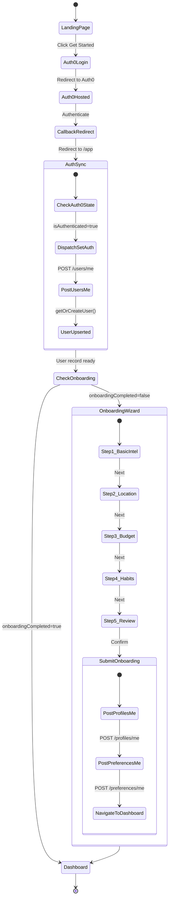
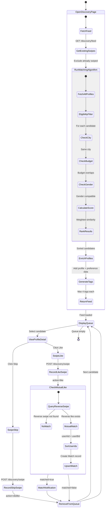
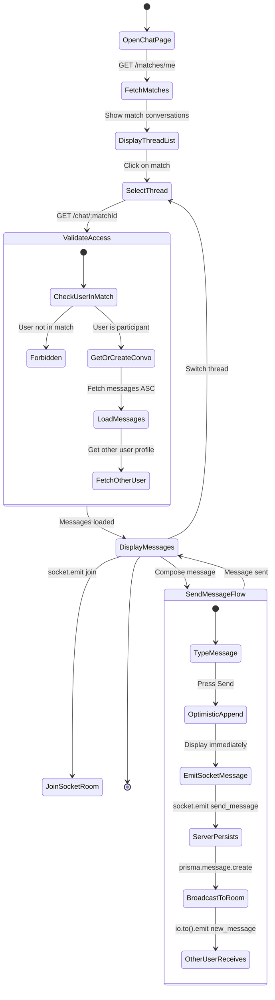

# Activity Diagrams — Flately

## Activity Diagram 1: User Registration & Onboarding Flow

```mermaid
stateDiagram-v2
    [*] --> LandingPage

    LandingPage --> Auth0Login : Click Get Started
    Auth0Login --> Auth0Hosted : Redirect to Auth0
    Auth0Hosted --> CallbackRedirect : Authenticate
    CallbackRedirect --> AuthSync : Redirect to /app

    state AuthSync {
        [*] --> CheckAuth0State
        CheckAuth0State --> DispatchSetAuth : isAuthenticated=true
        DispatchSetAuth --> PostUsersMe : POST /users/me
        PostUsersMe --> UserUpserted : getOrCreateUser()
    }

    AuthSync --> CheckOnboarding : User record ready
    CheckOnboarding --> OnboardingWizard : onboardingCompleted=false
    CheckOnboarding --> Dashboard : onboardingCompleted=true

    state OnboardingWizard {
        [*] --> Step1_BasicIntel
        Step1_BasicIntel --> Step2_Location : Next
        Step2_Location --> Step3_Budget : Next
        Step3_Budget --> Step4_Habits : Next
        Step4_Habits --> Step5_Review : Next
        Step5_Review --> SubmitOnboarding : Confirm
    }

    state SubmitOnboarding {
        [*] --> PostProfilesMe
        PostProfilesMe --> PostPreferencesMe : POST /profiles/me
        PostPreferencesMe --> NavigateToDashboard : POST /preferences/me
    }

    OnboardingWizard --> Dashboard
    Dashboard --> [*]
```

## Activity Diagram 2: Discovery Feed & Swipe Flow

```mermaid
stateDiagram-v2
    [*] --> OpenDiscoveryPage

    state OpenDiscoveryPage {
        [*] --> FetchFeed
        FetchFeed --> GetExistingSwipes : GET /discovery/feed
        GetExistingSwipes --> RunMatchingAlgorithm : Exclude already swiped

        state RunMatchingAlgorithm {
            [*] --> FetchAllProfiles
            FetchAllProfiles --> EligibilityFilter
            EligibilityFilter --> CheckCity : For each candidate
            CheckCity --> CheckBudget : Same city
            CheckBudget --> CheckGender : Budget overlaps
            CheckGender --> CalculateScore : Gender compatible
            CalculateScore --> RankResults : Weighted similarity
        }

        RunMatchingAlgorithm --> EnrichProfiles : Sorted candidates
        EnrichProfiles --> GenerateTags : Add profile + preference data
        GenerateTags --> ReturnFeed : Max 4 tags each
    }

    OpenDiscoveryPage --> DisplayQueue : Feed loaded
    DisplayQueue --> ViewProfileDetail : Select candidate

    ViewProfileDetail --> SwipeLike : Click Like
    ViewProfileDetail --> SwipeSkip : Click Skip

    SwipeSkip --> RecordSkipSwipe : POST /discovery/swipe
    RecordSkipSwipe --> RemoveFromQueue : action=dislike
    RemoveFromQueue --> DisplayQueue : Next candidate

    SwipeLike --> RecordLikeSwipe : POST /discovery/swipe
    RecordLikeSwipe --> CheckMutualLike : action=like

    state CheckMutualLike {
        [*] --> QueryReverseSwipe
        QueryReverseSwipe --> NoMatch : Reverse swipe not found
        QueryReverseSwipe --> MutualMatch : Reverse like exists
        MutualMatch --> SortUserIds : userAId < userBId
        SortUserIds --> UpsertMatch : Create Match record
    }

    CheckMutualLike --> MatchNotification : matched=true
    CheckMutualLike --> RemoveFromQueue : matched=false
    MatchNotification --> RemoveFromQueue

    RemoveFromQueue --> DisplayQueue
    DisplayQueue --> [*] : Queue empty
```

## Activity Diagram 3: Real-Time Chat Flow

```mermaid
stateDiagram-v2
    [*] --> OpenChatPage

    OpenChatPage --> FetchMatches : GET /matches/me
    FetchMatches --> DisplayThreadList : Show match conversations

    DisplayThreadList --> SelectThread : Click on match
    SelectThread --> ValidateAccess : GET /chat/:matchId

    state ValidateAccess {
        [*] --> CheckUserInMatch
        CheckUserInMatch --> Forbidden : User not in match
        CheckUserInMatch --> GetOrCreateConvo : User is participant
        GetOrCreateConvo --> LoadMessages : Fetch messages ASC
        LoadMessages --> FetchOtherUser : Get other user profile
    }

    ValidateAccess --> DisplayMessages : Messages loaded
    DisplayMessages --> JoinSocketRoom : socket.emit join

    state SendMessageFlow {
        [*] --> TypeMessage
        TypeMessage --> OptimisticAppend : Press Send
        OptimisticAppend --> EmitSocketMessage : Display immediately
        EmitSocketMessage --> ServerPersists : socket.emit send_message
        ServerPersists --> BroadcastToRoom : prisma.message.create
        BroadcastToRoom --> OtherUserReceives : io.to().emit new_message
    }

    DisplayMessages --> SendMessageFlow : Compose message
    SendMessageFlow --> DisplayMessages : Message sent
    DisplayMessages --> SelectThread : Switch thread
    DisplayMessages --> [*]
```
