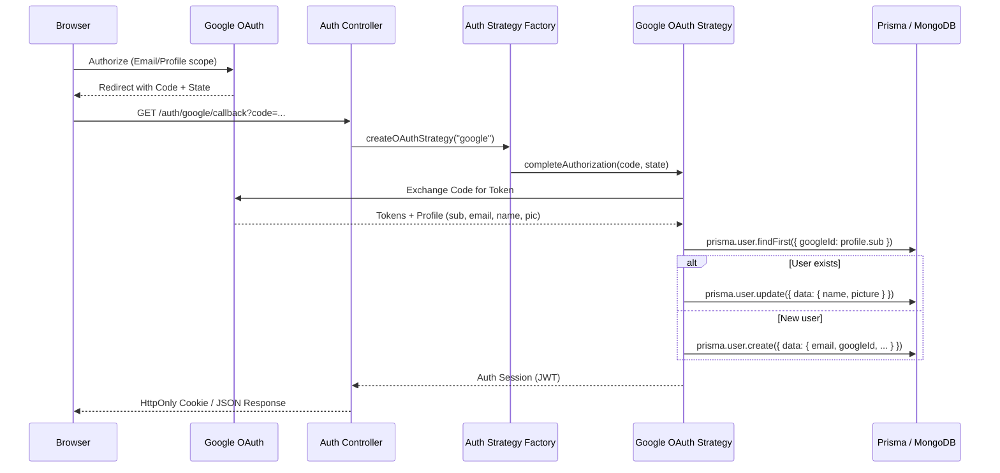
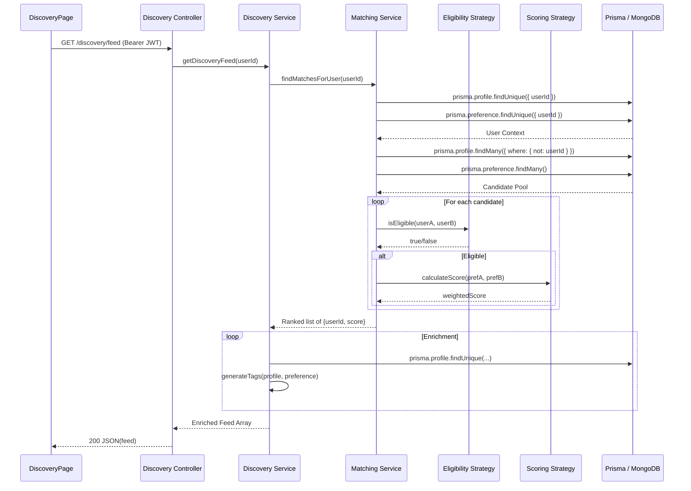
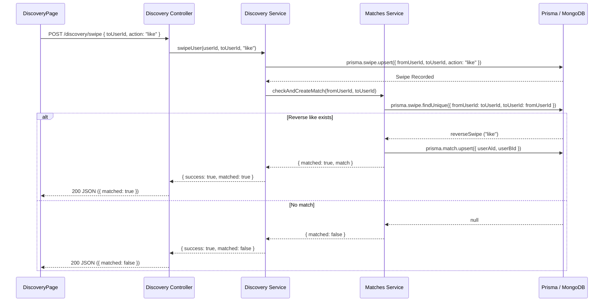
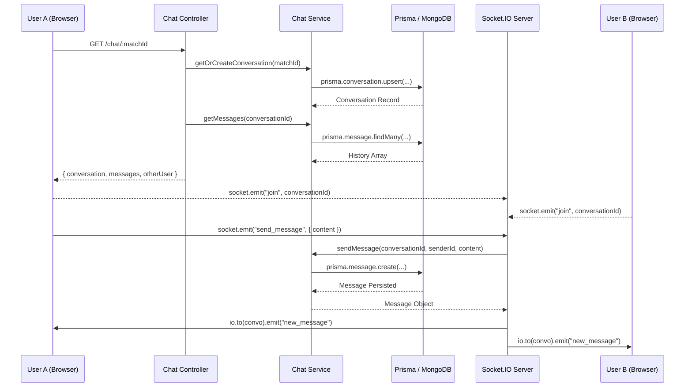

# Sequence Diagrams — Flately

## Sequence Diagram 1: Authentication & User Sync (Google OAuth)

## Sequence Diagram 2: Discovery Feed Loading (Matching Engine)

## Sequence Diagram 3: Swipe Connect → Match Creation

## Sequence Diagram 4: Real-Time Chat (Socket.IO)

