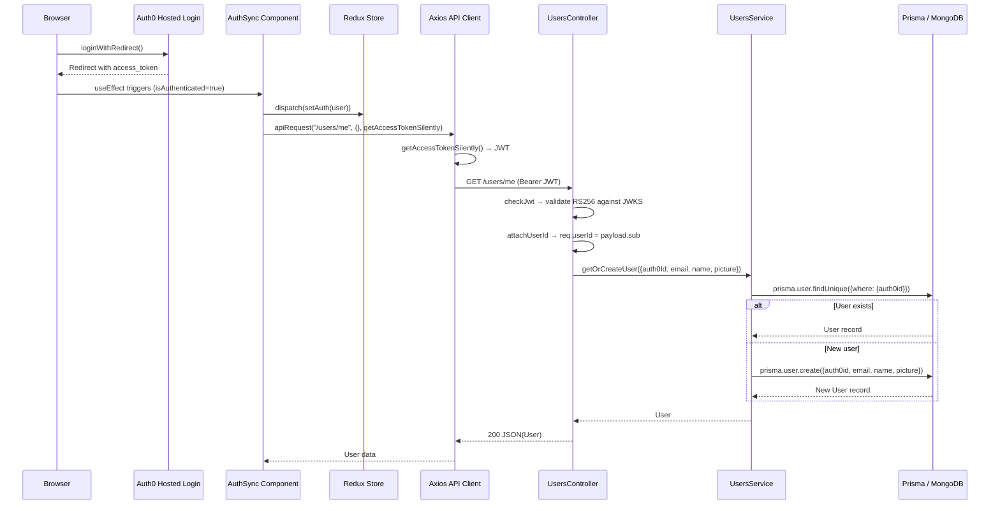
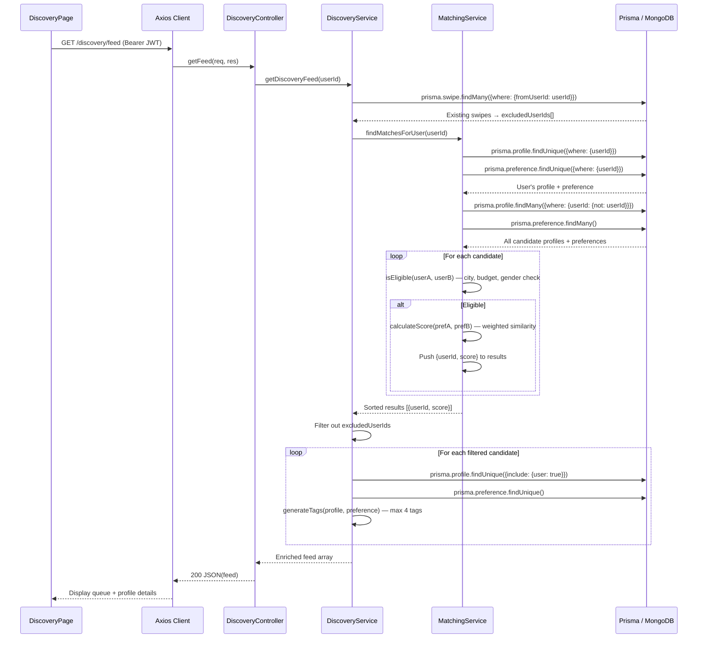
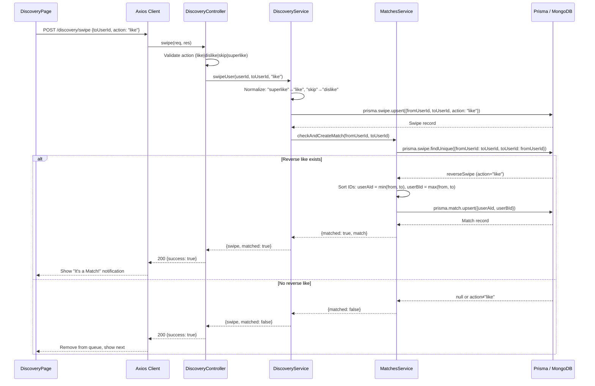
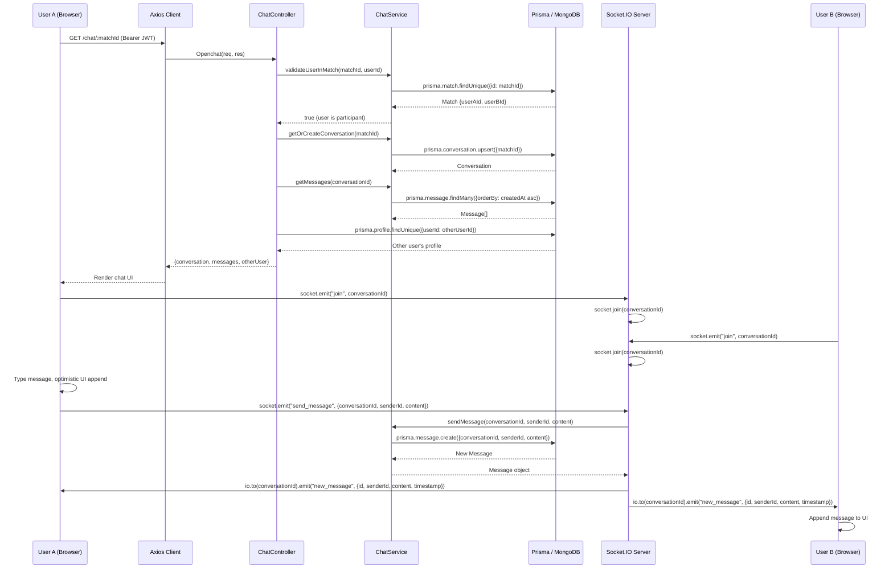

# Sequence Diagrams — Flately

## Sequence Diagram 1: Authentication & User Sync

## Sequence Diagram 2: Discovery Feed Loading

## Sequence Diagram 3: Swipe Like → Mutual Match

## Sequence Diagram 4: Real-Time Chat (Socket.IO)

