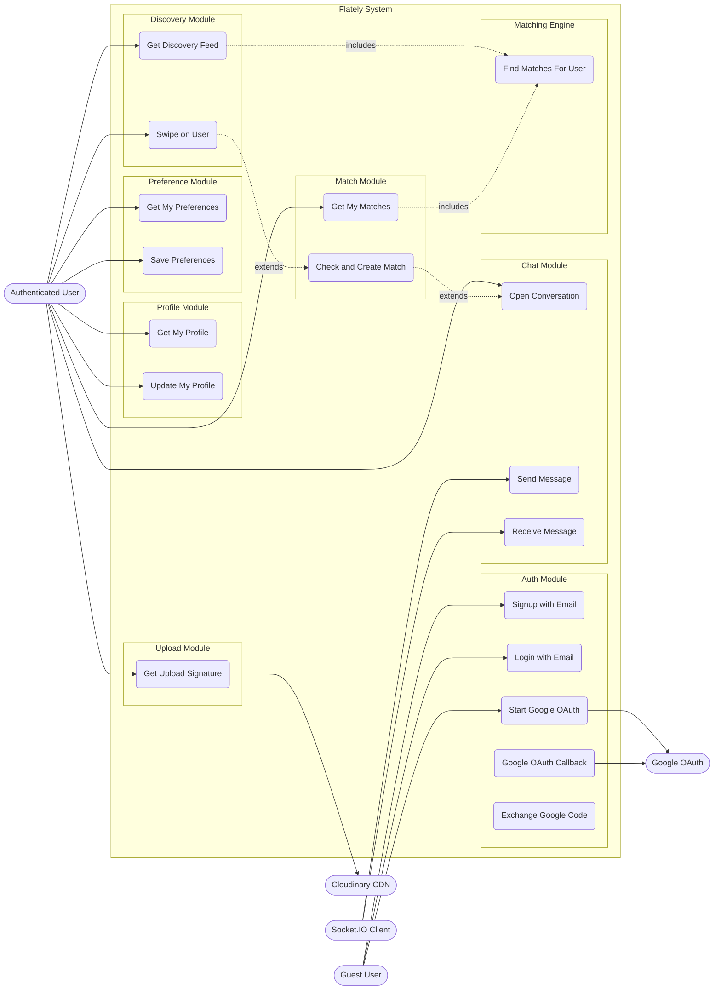
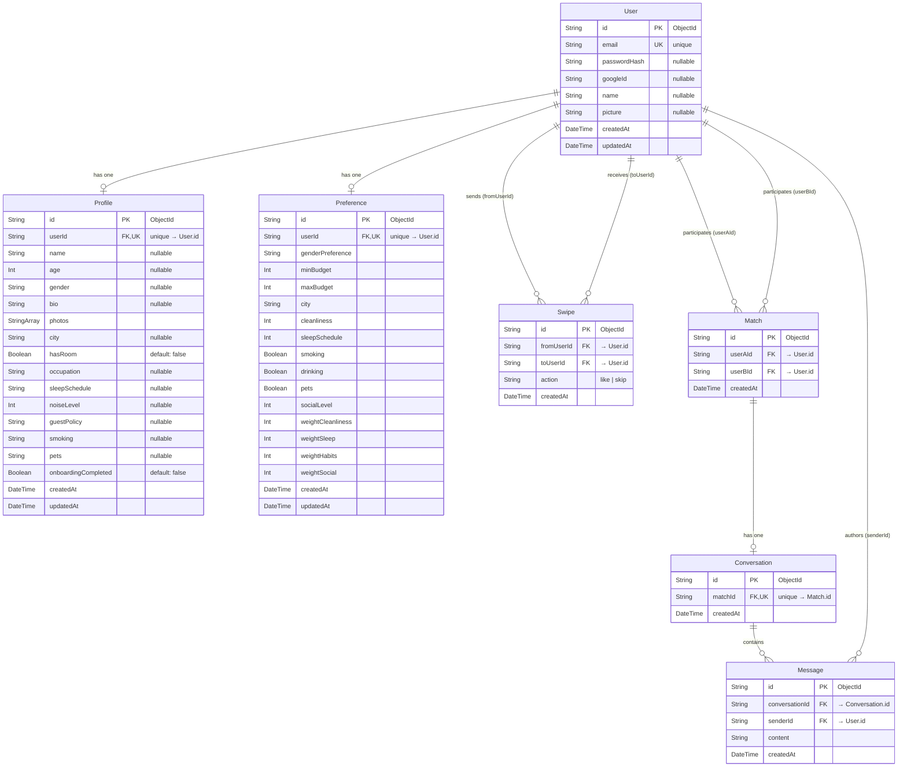
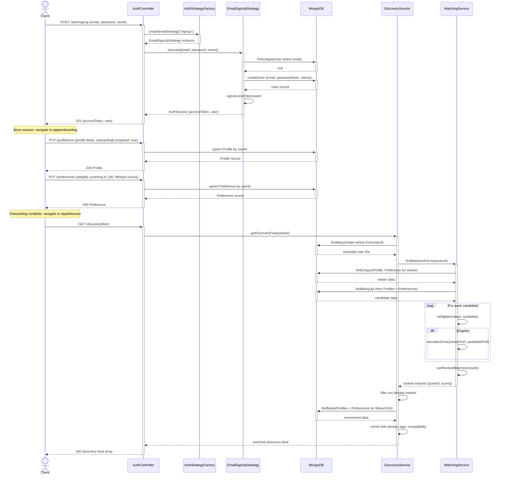
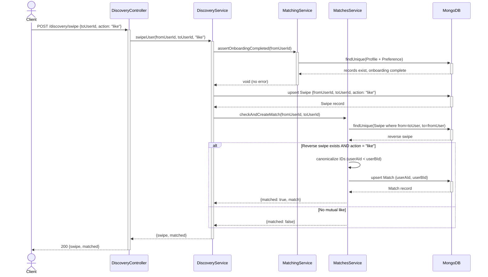
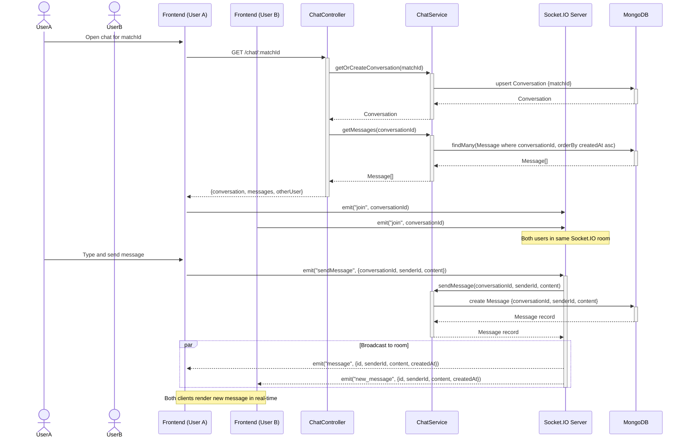
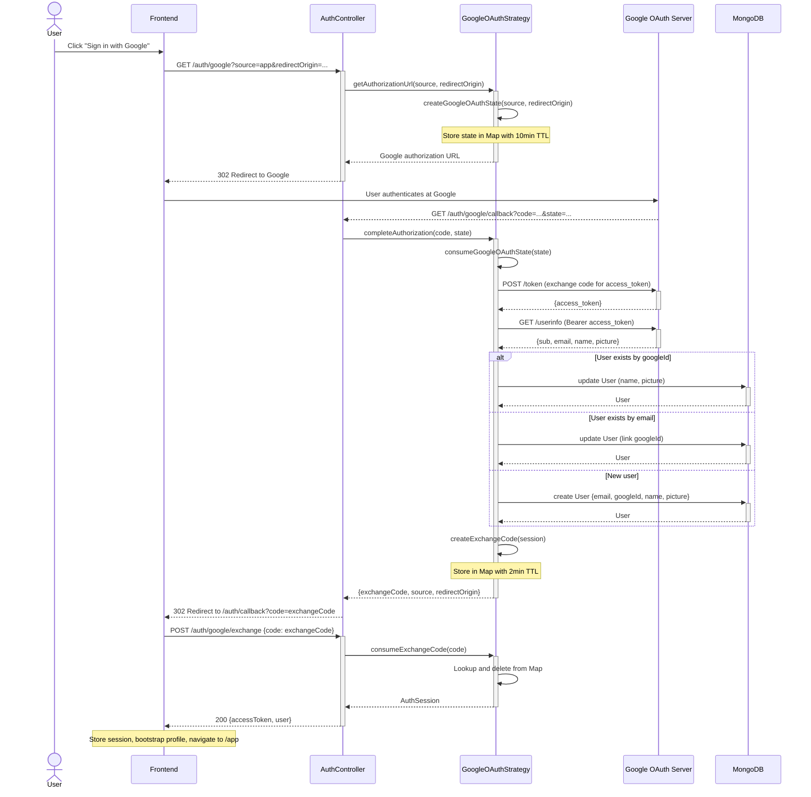

# Flately — UML Diagrams (Mermaid)

## 1. Class Diagram

```mermaid
classDiagram
    direction TB

    %% ═══════════════════════════════════════
    %% INTERFACES
    %% ═══════════════════════════════════════

    class EmailAuthStrategy {
        <<interface>>
        +execute(credentials: EmailCredentials) Promise~AuthSession~
    }

    class OAuthAuthorizationStrategy {
        <<interface>>
        +getAuthorizationUrl(source?: string, redirectOrigin?: string) string
        +completeAuthorization(code: string, state: string) Promise~object~
        +consumeExchangeCode(code: string) AuthSession
    }

    class EmailAuthStrategyFactory {
        <<interface>>
        +create(intent: EmailAuthIntent) EmailAuthStrategy
    }

    class OAuthAuthorizationStrategyFactory {
        <<interface>>
        +create(provider: OAuthProvider) OAuthAuthorizationStrategy
    }

    class EligibilityStrategy {
        <<interface>>
        +isEligible(userA: CandidateShape, userB: CandidateShape) boolean
    }

    class ScoringStrategy {
        <<interface>>
        +calculateScore(prefA: PreferenceShape, prefB: PreferenceShape) number
    }

    class RequestStrategy {
        <<interface>>
        +send~T~(request: NormalizedRequest) Promise~T~
    }

    %% ═══════════════════════════════════════
    %% ABSTRACT CLASSES
    %% ═══════════════════════════════════════

    class UpsertByUserIdService~TUpdateData_TCreateData_TResult~ {
        <<abstract>>
        #findByUserId(userId: string) Promise~TResult~*
        #updateByUserId(userId: string, data: TUpdateData) Promise~TResult~*
        #mapCreateData(userId: string, data: TUpdateData) TCreateData*
        #createByUserId(data: TCreateData) Promise~TResult~*
        +upsert(userId: string, data: TUpdateData) Promise~TResult~
    }

    %% ═══════════════════════════════════════
    %% AUTH MODULE CLASSES
    %% ═══════════════════════════════════════

    class EmailSignUpStrategy {
        +execute(credentials: EmailCredentials) Promise~AuthSession~
    }

    class EmailSignInStrategy {
        +execute(credentials: EmailCredentials) Promise~AuthSession~
    }

    class GoogleOAuthStrategy {
        -googleOAuthStates: Map~string_GoogleOAuthStateEntry~
        -googleExchangeCodes: Map~string_GoogleExchangeCodeEntry~
        +getAuthorizationUrl(source?: string, redirectOrigin?: string) string
        +completeAuthorization(code: string, state: string) Promise~object~
        +consumeExchangeCode(code: string) AuthSession
        -cleanExpiredGoogleOAuthState() void
        -cleanExpiredExchangeCodes() void
        -getGoogleConfig() object
        -createGoogleOAuthState(source?: string, redirectOrigin?: string) string
        -consumeGoogleOAuthState(state: string) GoogleOAuthStateEntry
        -createExchangeCode(session: AuthSession) string
        -fetchGoogleUserProfile(code: string) Promise~GoogleUserProfile~
    }

    class DefaultEmailAuthStrategyFactory {
        -creators: Record~EmailAuthIntent_Function~
        +create(intent: EmailAuthIntent) EmailAuthStrategy
    }

    class DefaultOAuthAuthorizationStrategyFactory {
        -googleOAuthStates: Map~string_GoogleOAuthStateEntry~
        -googleExchangeCodes: Map~string_GoogleExchangeCodeEntry~
        +create(provider: OAuthProvider) OAuthAuthorizationStrategy
    }

    class AuthStrategyFactory {
        -emailFactory: EmailAuthStrategyFactory
        -oauthFactory: OAuthAuthorizationStrategyFactory
        +createEmailStrategy(intent: EmailAuthIntent) EmailAuthStrategy
        +createOAuthStrategy(provider: OAuthProvider) OAuthAuthorizationStrategy
    }

    %% ═══════════════════════════════════════
    %% MATCHING MODULE CLASSES
    %% ═══════════════════════════════════════

    class DefaultEligibilityStrategy {
        +isEligible(userA: CandidateShape, userB: CandidateShape) boolean
    }

    class DefaultScoringStrategy {
        -similarityScore(a: number, b: number, max: number) number
        -booleanScore(a: boolean, b: boolean) number
        +calculateScore(prefA: PreferenceShape, prefB: PreferenceShape) number
    }

    class MatchingService {
        -eligibilityStrategy: EligibilityStrategy
        -scoringStrategy: ScoringStrategy
        +findMatchesForUser(userId: string) Promise~Array~
        +assertOnboardingCompleted(userId: string) Promise~void~
    }

    %% ═══════════════════════════════════════
    %% DOMAIN SERVICE CLASSES
    %% ═══════════════════════════════════════

    class DiscoveryService {
        -dependencies: DiscoveryServiceDependencies
        +getDiscoveryFeed(userId: string) Promise~Array~
        +swipeUser(fromUserId: string, toUserId: string, action: string) Promise~object~
        -generateTags(profile: TaggableProfile, preference: TaggablePreference) string[]
    }

    class MatchesService {
        -dependencies: MatchesServiceDependencies
        +checkAndCreateMatch(fromUserId: string, toUserId: string) Promise~MatchCheckResult~
        +getMyMatches(userId: string) Promise~Array~
        -generateMatchTags(profile: object, preference: object) string[]
    }

    class ChatService {
        +getOrCreateConversation(matchId: string) Promise~Conversation~
        +getMessages(conversationId: string) Promise~Message[]~
        +sendMessage(conversationId: string, senderId: string, content: string) Promise~Message~
        +validateUserInMatch(matchId: string, userId: string) Promise~boolean~
    }

    class ProfileUpsertService {
        #findByUserId(userId: string) Promise~ProfileRecord~
        #updateByUserId(userId: string, data: ProfileUpdateData) Promise~ProfileRecord~
        #mapCreateData(userId: string, data: ProfileUpdateData) ProfileCreateData
        #createByUserId(data: ProfileCreateData) Promise~ProfileRecord~
    }

    class ProfileService {
        +getProfileByUserId(userId: string) Promise~Profile~
        +createOrUpdateProfile(userId: string, data: ProfileUpdateData) Promise~Profile~
    }

    class PreferenceUpsertService {
        #findByUserId(userId: string) Promise~PreferenceRecord~
        #updateByUserId(userId: string, data: PreferenceData) Promise~PreferenceRecord~
        #mapCreateData(userId: string, data: PreferenceData) PreferenceCreateData
        #createByUserId(data: PreferenceCreateData) Promise~PreferenceRecord~
    }

    class PreferencesService {
        +getPreferences(userId: string) Promise~Preference~
        +savePreferences(userId: string, data: PreferenceData) Promise~Preference~
    }

    class UploadsService {
        +getCloudinaryUploadSignature() CloudinaryUploadSignature
        -normalizeFolder(folder: string) string
        -ensureCloudinaryConfig() object
        -createCloudinarySignature(parameters: Record, apiSecret: string) string
    }

    %% ═══════════════════════════════════════
    %% FRONTEND CLASSES
    %% ═══════════════════════════════════════

    class ApiError {
        +status: number
        +data: unknown
        +url: string
    }

    class FetchRequestStrategy {
        +send~T~(request: NormalizedRequest) Promise~T~
    }

    class HttpClientAdapter {
        -strategy: RequestStrategy
        -baseUrl: string
        +request~T~(config: ApiRequestConfig) Promise~T~
    }

    %% ═══════════════════════════════════════
    %% RELATIONSHIPS — Realisation (implements)
    %% ═══════════════════════════════════════

    EmailAuthStrategy <|.. EmailSignUpStrategy
    EmailAuthStrategy <|.. EmailSignInStrategy
    OAuthAuthorizationStrategy <|.. GoogleOAuthStrategy
    EmailAuthStrategyFactory <|.. DefaultEmailAuthStrategyFactory
    OAuthAuthorizationStrategyFactory <|.. DefaultOAuthAuthorizationStrategyFactory
    EligibilityStrategy <|.. DefaultEligibilityStrategy
    ScoringStrategy <|.. DefaultScoringStrategy
    RequestStrategy <|.. FetchRequestStrategy

    %% ═══════════════════════════════════════
    %% RELATIONSHIPS — Inheritance (extends)
    %% ═══════════════════════════════════════

    UpsertByUserIdService~TUpdateData_TCreateData_TResult~ <|-- ProfileUpsertService
    UpsertByUserIdService~TUpdateData_TCreateData_TResult~ <|-- PreferenceUpsertService
    Error <|-- ApiError

    %% ═══════════════════════════════════════
    %% RELATIONSHIPS — Aggregation (constructor injection)
    %% ═══════════════════════════════════════

    AuthStrategyFactory o-- EmailAuthStrategyFactory
    AuthStrategyFactory o-- OAuthAuthorizationStrategyFactory
    MatchingService o-- EligibilityStrategy
    MatchingService o-- ScoringStrategy
    HttpClientAdapter o-- RequestStrategy

    %% ═══════════════════════════════════════
    %% RELATIONSHIPS — Dependency
    %% ═══════════════════════════════════════

    DefaultEmailAuthStrategyFactory ..> EmailSignUpStrategy : creates
    DefaultEmailAuthStrategyFactory ..> EmailSignInStrategy : creates
    DefaultOAuthAuthorizationStrategyFactory ..> GoogleOAuthStrategy : creates
    ProfileService ..> ProfileUpsertService : delegates
    PreferencesService ..> PreferenceUpsertService : delegates
    DiscoveryService ..> MatchingService : uses
    DiscoveryService ..> MatchesService : uses
    MatchesService ..> MatchingService : uses
```

---

## 2. Use Case Diagram

> Mermaid has no native use-case diagram type. Modelled as a flowchart with actor and system-boundary semantics.

---

## 3. Entity Relationship Diagram

---

## 4. Sequence Diagrams

### 4a. Email Signup → Onboarding → First Discovery

### 4b. Swipe → Mutual Match Creation

### 4c. Real-Time Chat via Socket.IO

### 4d. Google OAuth Flow

